<div class="MCWHeader1">
Azure Migration
</div>

<div class="MCWHeader2">
Hands-on lab step-by-step
</div>

<div class="MCWHeader3">
April 2019
</div>


Information in this document, including URL and other Internet Web site references, is subject to change without notice. Unless otherwise noted, the example companies, organizations, products, domain names, e-mail addresses, logos, people, places, and events depicted herein are fictitious, and no association with any real company, organization, product, domain name, e-mail address, logo, person, place or event is intended or should be inferred. Complying with all applicable copyright laws is the responsibility of the user. Without limiting the rights under copyright, no part of this document may be reproduced, stored in or introduced into a retrieval system, or transmitted in any form or by any means (electronic, mechanical, photocopying, recording, or otherwise), or for any purpose, without the express written permission of Microsoft Corporation.

Microsoft may have patents, patent applications, trademarks, copyrights, or other intellectual property rights covering subject matter in this document. Except as expressly provided in any written license agreement from Microsoft, the furnishing of this document does not give you any license to these patents, trademarks, copyrights, or other intellectual property.

The names of manufacturers, products, or URLs are provided for informational purposes only and Microsoft makes no representations and warranties, either expressed, implied, or statutory, regarding these manufacturers or the use of the products with any Microsoft technologies. The inclusion of a manufacturer or product does not imply endorsement of Microsoft of the manufacturer or product. Links may be provided to third party sites. Such sites are not under the control of Microsoft and Microsoft is not responsible for the contents of any linked site or any link contained in a linked site, or any changes or updates to such sites. Microsoft is not responsible for webcasting or any other form of transmission received from any linked site. Microsoft is providing these links to you only as a convenience, and the inclusion of any link does not imply endorsement of Microsoft of the site or the products contained therein.

© 2019 Microsoft Corporation. All rights reserved.

Microsoft and the trademarks listed at <https://www.microsoft.com/en-us/legal/intellectualproperty/Trademarks/Usage/General.aspx> are trademarks of the Microsoft group of companies. All other trademarks are property of their respective owners.

**Contents** 

<!-- TOC -->

- [Azure Migration hands-on lab step-by-step](#azure-migration-hands-on-lab-step-by-step)
  - [Abstract and learning objectives](#abstract-and-learning-objectives)
  - [Overview](#overview)
  - [Solution architecture](#solution-architecture)
  - [Requirements](#requirements)
  - [Before the hands-on lab](#before-the-hands-on-lab)
  - [Exercise 1: Discover and assess the on-premises environment](#exercise-1-discover-and-assess-the-on-premises-environment)
    - [Task 1: Create the Azure Migrate project](#task-1-create-the-azure-migrate-project)
    - [Task 2: Deploy the Azure Migrate appliance](#task-2-deploy-the-azure-migrate-appliance)
    - [Task 3: Configure the Azure Migrate appliance](#task-3-configure-the-azure-migrate-appliance)
    - [Task 3: Create a migration assessment](#task-3-create-a-migration-assessment)
  - [Exercise 2: Migrate the Application Database](#exercise-2-migrate-the-application-database)
    - [Overview](#overview-1)
    - [Task 1: Create an Azure SQL Database](#task-1-create-an-azure-sql-database)
    - [Task 2: Assess the on-premises database](#task-2-assess-the-on-premises-database)
    - [Task 3: Migrate On-premises database schema](#task-3-migrate-on-premises-database-schema)
    - [Task 4: Register the Microsoft.DataMigration resource provider](#task-4-register-the-microsoftdatamigration-resource-provider)
    - [Task 5: Create the Database Migration Service](#task-5-create-the-database-migration-service)
    - [Task 6: Migrate the on-premises data](#task-6-migrate-the-on-premises-data)
  - [Exercise 3: Migrate the application and web tiers using Azure Site Recovery](#exercise-3-migrate-the-application-and-web-tiers-using-azure-site-recovery)
    - [Task 1: Create a Storage Account](#task-1-create-a-storage-account)
    - [Task 2: Create a Recovery Services Vault](#task-2-create-a-recovery-services-vault)
    - [Task 3: Create a Virtual Network](#task-3-create-a-virtual-network)
    - [Task 4: Prepare On-premises Virtual Machines](#task-4-prepare-on-premises-virtual-machines)
    - [Task 5: Configure Azure Site Recovery](#task-5-configure-azure-site-recovery)
    - [Task 6: Create a Recovery Plan](#task-6-create-a-recovery-plan)
    - [Task 7: Configure Azure VM settings](#task-7-configure-azure-vm-settings)
    - [Task 8: Test Failover](#task-8-test-failover)
    - [Task 9: Configure database connection](#task-9-configure-database-connection)
    - [Task 10: Configure public IP and test application](#task-10-configure-public-ip-and-test-application)
    - [Task 11: Cleanup the test failover](#task-11-cleanup-the-test-failover)
  - [After the hands-on lab](#after-the-hands-on-lab)
    - [Task 1: Clean up resources](#task-1-clean-up-resources)

<!-- /TOC -->

# Azure Migration hands-on lab step-by-step 

## Abstract and learning objectives 

In this hands-on lab, you will learn how to assess and migrate a multi-tier application from Hyper-V to Azure. You will learn the various Azure tools available for different steps of the migration, and walk through using each of those tools.

After this hands-on lab, you will know the role of each of the migration tools and how to use them to successfully migrate an on-premises multi-tier application to Azure.

## Overview

Before the lab, you will have pre-deployed an on-premises infrastructure hosted in Hyper-V.  This infrastructure is hosting a multi-tier application called 'SmartHotel', using Hyper-V VMs for each of the application tiers.

During the lab, you will migrate this entire application stack to Azure. This will include assessing the on-premises application using Azure Migrate; migrating the database tier to Azure SQL Database using SQL Server Data Migration Assistant (DMA) and the Azure Database Migration Service (DMS); and migrating the web and application tiers using Azure Site Recovery. This includes migration of both Windows and Linux VMs.


## Solution architecture

The SmartHotel application comprises 4 VMs hosted in Hyper-V:
- **Database tier** Hosted on the smarthotelSQL1 VM, which is running Windows Server 2016 and SQL Server 2017
- **Application tier** Hosted on the smarthotelweb2 VM, which is running Windows Server 2012R2.
- **Web tier** Hosted on the smarthotelweb1 VM, which is running Windows Server 2012R2.
- **Web proxy** Hosted on the  UbuntuWAF VM, which is running Nginx on Ubuntu 18.04 LTS.

(For simplicity, there is no redundancy in any of the tiers.)

**Note:** For convenience, the Hyper-V host itself is deployed as an Azure VM. For the purposes of the lab, you should think of it as an on-premises machine.

TODO ADD PICTURE

To assess the Hyper-V environment, you will use Azure Migrate. This includes deploying the Azure Migrate appliance on the Hyper-V host to gather information about the environment. For deeper analysis, the Microsoft Monitoring Agent and Dependency Agent will be installed on the VMs, enabling the Azure Migrate dependency visualization.

The SQL Server database will be assessed by installing the Microsoft SQL Server Data Migration Assistant (DMA) on the Hyper-V host, and using it to gather information about the database. The DMA will also be used to migrate the database schema to Azure SQL Database. Data migration will then be completed using the Azure Database Migration Service (DMS).

The application, web, and web proxy tiers will be migrated to Azure VMs using Azure Site Recovery (ASR). This includes deploying the ASR collector appliance into the Hyper-V environment, building the Azure environment, replicating data to Azure, and performing a failover to migrate the application to Azure.

**Note:** After migration, the application could be modernized to use Azure Application Gateway instead of the Ubuntu Nginx VM, and to use Azure App Service to host both the web tier and application tier. These optimizations are out of scope of this lab, which is focused only on a 'lift and shift' migration to Azure VMs.

## Requirements

1.  You will need Owner or Contributor permissions for an Azure subscription to use in the lab.

2.  Your subscription must have sufficient unused quota to deploy the VMs used in this lab.

3.  Your subscription must be registered for the Azure Migrate v2 Preview.

For further details, see [Before the HOL - Azure Migration](./Before%20the%20HOL%20-%20Azure%20Migration.md).

## Before the hands-on lab

Refer to the [Before the HOL - Azure Migration](./Before%20the%20HOL%20-%20Azure%20Migration.md) setup guide manual before continuing to the lab exercises.

**Allow at least 60 minutes to deploy the on-premises environment before you start the lab.**

## Exercise 1: Discover and assess the on-premises environment

Duration: 60 minutes

In this exercise, you will use Azure Migrate to assess the on-premises environment.

### Task 1: Create the Azure Migrate project

In this task, you will create the Azure Migrate project and select the migration assessment tool.

1.  Open your browser and navigate to http://aka.ms/migrate/preview. This special link is used during the Azure Migrate v2 preview phase to access the Azure Portal with the Azure Migrate v2 service enabled.

2.  Click **All services**, then search for and select  **Azure Migrate** to open the Azure Migrate Overview blade, shown below.

    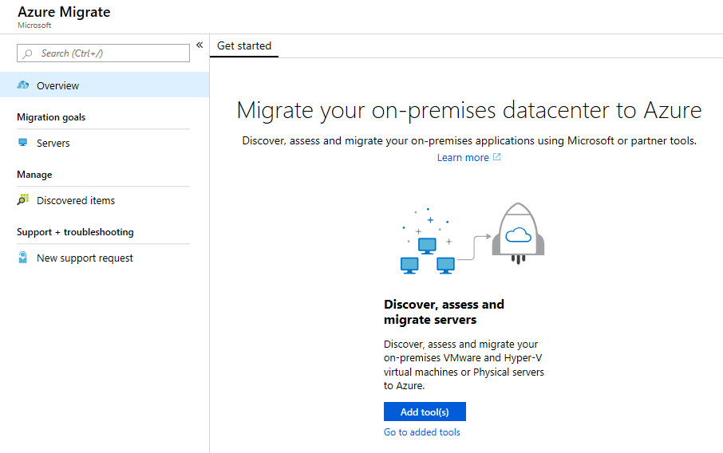

3.  Click the **Add tool(s)** button to open the 'Add a tool' wizard at the 'Migrate project' step.  Select your subscription and create a new resource group named **AzureMigrateRG**. Choose a geography close to you to store the migration assessment data (Note: options may be limited during the preview phase).

    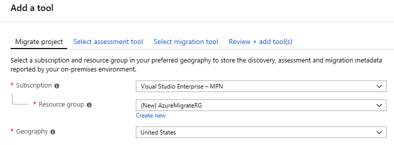

    Click **Next**.

4.  At the 'Select assessment tool' step, select **Azure Migrate: Server Assessment**, then click **Next**.

    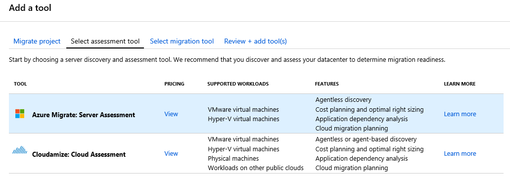

5.  At the 'Select migration tool' step, check the **Skip adding a migration tool for now** checkbox, then click **Next**.

    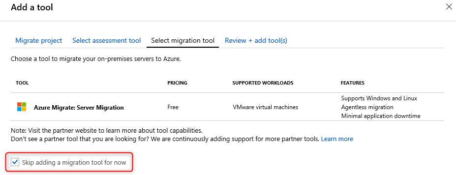

6.  At the 'Review + add tool(s)' step, review the settings and click **Add tool(s)**.

    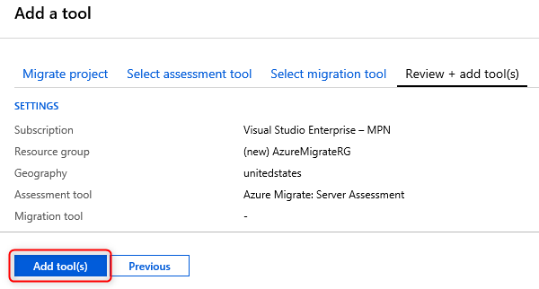

7.  The Azure Migrate deployment will start. Once it has completed, click on the **Servers** panel of the Azure Migrate blade. Select your subscription and the **AzureMigrateRG** resource group from the drop-downs. You should now see 'Azure Migrate: Server Assessment', as shown below.

    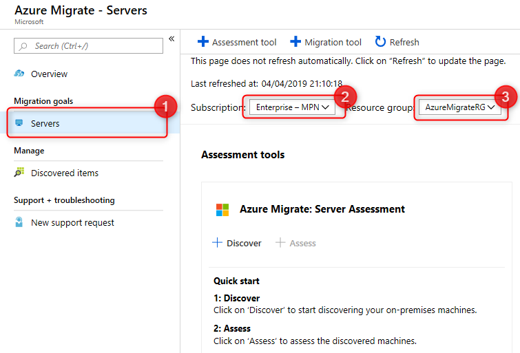

### Task 2: Deploy the Azure Migrate appliance

In this task, you will deploy and configure the Azure Migrate appliance in the on-premises Hyper-V environment. This appliance communicates with the Hyper-V server to gather configuration and performance data about your on-premises VMs.

1.  Click **Discover** to open the 'Discover machines' blade. Under 'Are your machines virtualized?', select **Yes, with Hyper-V**.

    

    Read through the instructions on how to download, deploy and configure the Azure Migrate appliance. Close the 'Discover machines' blade (do **not** download the .VHD file, it has already been downloaded for you).
    
2.  In the top ribbon, enter **SmartHotelHost** into the search box, then click on the **SmartHotelHost** virtual machine.
    
    

3.  Click **Connect**, then download the RDP file and connect to the virtual machine using username **demouser** and password **demo@pass123**.
   
4.  In the SmartHotelHost RDP session, if Server Manager does not open automatically, open it by clicking **Start**, then **Server Manager**.

5.  In Server Manager, click **Tools**, then **Hyper-V Manager**. In Hyper-V manager, click **SMARTHOTELHOST**. You should now see a list of the four VMs that comprise the on-premises SmartHotel application.

    


Before deploying the Azure Migrate appliance virtual machine, we need to create a network switch that it will use to communicate with the Hyper-V host. We could use the existing switch used by the SmartHotel VMs, but since the Azure Migrate appliance does not need to communicate with the SmartHotel VMs directly, we will protect our application environment by creating a separate switch.

6.  In Hyper-V Manager, under 'Actions', click **Virtual Switch Manager** to open the Virtual Switch Manager. The 'New virtual network switch' option should already be selected. Under 'Create virtual switch', select **Internal** as the virtual switch type, then click **Create Virtual Switch**.

    

7.  A new virtual switch is created. Change the name to **Azure Migrate Switch**, then click **OK**.

    

We will now deploy the Azure Migrate appliance virtual machine.  Normally, you would download the .ZIP file containing the appliance to your Hyper-V host, and unzip it. To save time, these steps have been completed for you.

8.  Back in Hyper-V Manager, under 'Actions', click **Import Virtual Machine...** to open the 'Import Virtual Machine' wizard.
   
    

9.  At the first step, 'Before You Begin', click **Next**.

10. At the 'Locate Folder' step, click **Browse** and navigate to **F:\VirtualMachines\AzureMigrateAppliance**, then click **Select Folder**, then click **Next**.

    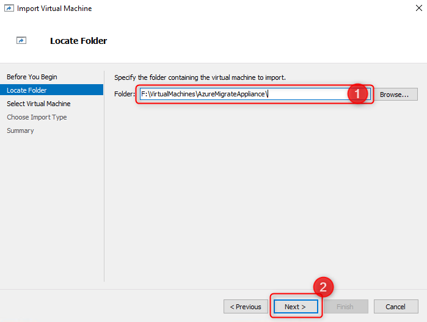

11. At the 'Select Virtual Machine' step, the **AzureMigrateAppliance** VM should already be selected. Click **Next**.

12. At the 'Choose Import Type' step, keep the default setting 'Register the virtual machine in-place'. Click **Next**.

13. At the 'Connect Network' step, you will see an error that the virtual switch previously used by the Azure Migrate appliance could not be found. From the 'Connection' drop down, select the **Azure Migrate Switch** you created earlier, then click **Next**.

    

14. Review the summary page, then click **Finish** to create the Azure Migrate appliance VM.

Before starting the Azure Migrate appliance, we must configure the network settings. The existing Hyper-V environment has a NAT network using the IP address space 192.168.0.0/16. The internal NAT switch used by the SmartHotel application uses the subnet 192.168.0.0/24, and each VM in the application has been assigned a static IP address from this subnet.

You will create a new subnet 192.168.1.0/24 within the existing NAT network, with gateway address 192.168.1.1. The Azure Migrate appliance VM will be assigned IP address 192.168.1.4.  These steps will be completed using a PowerShell script.

15. Open Windows Explorer, and navigate to the folder **C:\OpsgilityTraining**.
    
16. Right-click on the PowerShell script **ConfigureAzureMigrateApplianceNetwork**, and select **Run with PowerShell**.

    

 The Azure Migrate appliance is now ready to be started.

 17. In Hyper-V Manager, click on the **AzureMigrateAppliance** VM, then click **Start**.

    

### Task 3: Configure the Azure Migrate appliance

1.  In Hyper-V Manager, click on the **AzureMigrateAppliance** VM, then click **Connect**.

    

2.  A new window will open showing the Azure Migrate appliance. Wait for the License terms screen to show, then click **Accept**.

    

3.  On the 'Customize settings' screen, set the Administrator password to **demo@pass123** (twice). Then click **Finish**.

    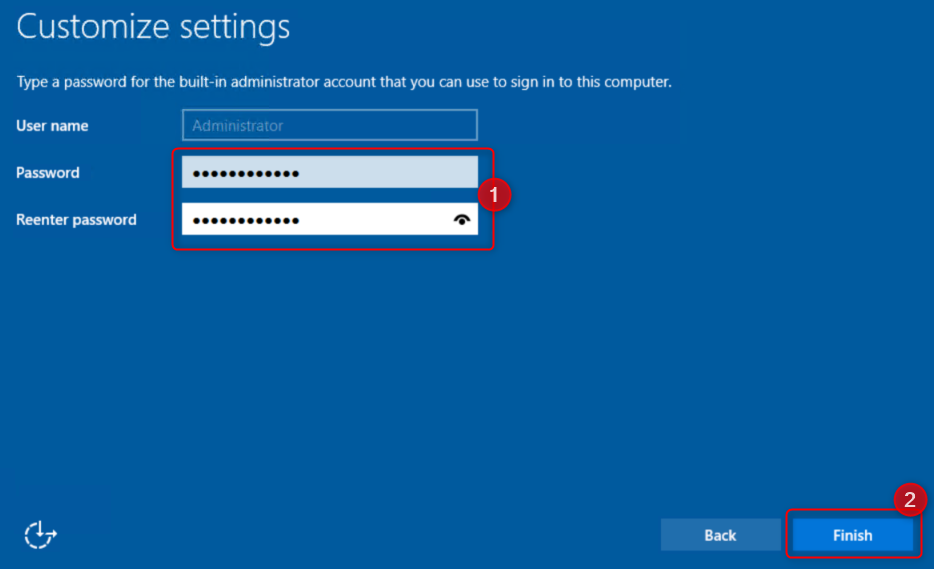

4.  At the 'Connect to AzureMigrateAppliance' prompt, set the appliance screen size using the slider, then click **Connect**.
   
    

5.  Log in with the Administrator password **demo@pass123**.
   
6.  **Wait.** After a minute or two, an Internet Explorer windows will open showing the Azure Migrate appliance configuration wizard. If the 'Set up Internet Explorer 11' prompt is shown, click **OK** to accept the recommended settings. If the Internet Explorer 'Content from the website listed below is being blocked...' prompt is shown, click **Close** and return to the Azure Migrate Appliance browser tab.

    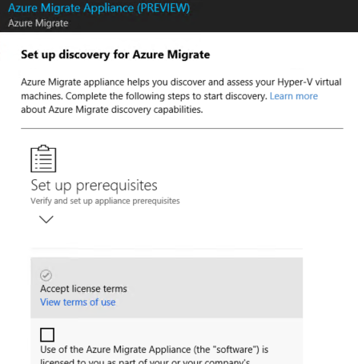

7.  Under **Set up prerequisites**, accept the license terms. The following two steps to verify Internet connectivity and time synchronization should pass automatically. Click **Continue**.

    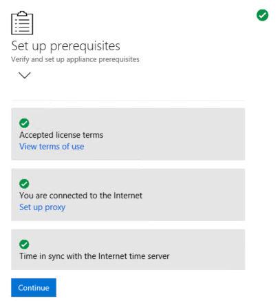

8.  At the next steps, 'Register with Azure Migrate', click **Login**. This opens a separate browser tab where you enter your Azure subscription credentials.
   
9.  Once you have logged in, return to the Azure Migrate Appliance tab and select your subscription and the **AzureMigrateRG** resource group using the drop-downs. Then click **Register**. After a short pause, the registration should be successful. Click **Continue**.

    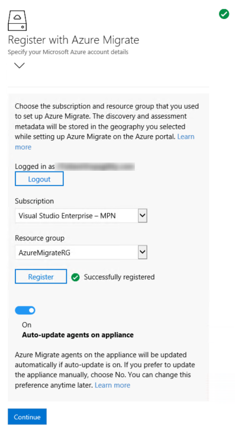

10. In the next step, 'Provide Hyper-V hosts details', enter the user name **demouser** and password **demo@pass123**. These are the credentials for the Hyper-V host. Enter **Host login** as the friendly name, then click **Save details**.

    

11. Under 'Specify the list of Hyper-V hosts and clusters to discover', click **Add**.

    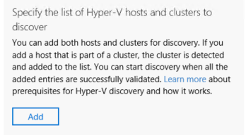

12. A window will appear prompting for a list of Hyper-V hosts. Enter the Hyper-V host IP address, **10.0.0.4**. Then click **Validate**.

    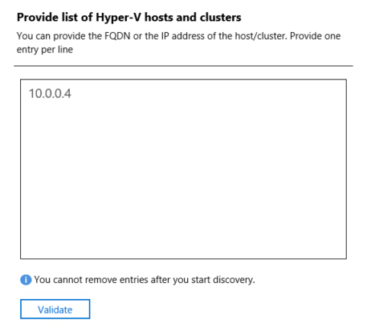

13. A table shows the SmartHotelHost, with status 'green'. Click **Save and start discovery**.

    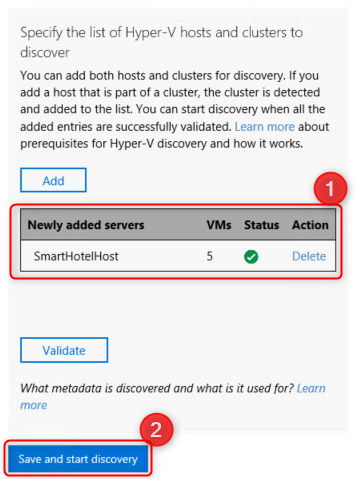

14. A message 'Create Site and initiating discovery' is shown.

    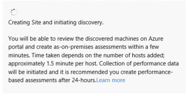

**Wait for the discovery process to complete before proceeding to the next Task (about 15 minutes)**.

### Task 3: Create a migration assessment

***BLOCKED AT THIS POINT - RAISED WITH AZURE MIGRATE PM***


## Exercise 2: Migrate the Application Database

### Overview

Duration: 60 minutes

In this exercise you will migrate the application database from the on-premises Hyper-V virtual machine to a new database hosted in the Azure SQL Database service. You will use the Azure Database Migration Service to complete the migration, which uses the SQL Server Data Migration Assistant for the database assessment and schema migration phases.

### Task 1: Create an Azure SQL Database

In this task you will create a new Azure SQL database to migrate the on-premises database to. You will also configure network access to the SQL database from the Hyper-V host that is running the SmartHotel application on-premises.

1.  Open the Azure portal at https://portal.azure.com and log in using your subscription credentials.

2.  Click **+ Create a resource**, then click **Databases**, then click **SQL Database**.

    

3.  The **Create SQL Database** blade opens, showing the 'Basics' tab. Complete the form as follows:

    - Subscription: **Select your subscription**
    - Resource group (create new): **SmartHotelDBRG**
    - Database name: **smarthoteldb**
    - Server: Click **Create new** and fill in the New server blade as follows:
        - Server name: **smarthoteldb\[add unique number\]**
        - Server admin login: **demouser**
        - Password: **demo@pass123**
        - Location: **IMPORTANT: Select the same region you used when you started your lab - this makes migration faster**

        >  **Note**: You can verify the location by opening another browser tab, navigating to https://portal.azure.com and clicking Virtual Machines on the left navigation. Use the same region as the **SmartHotelHost** virtual machine.

    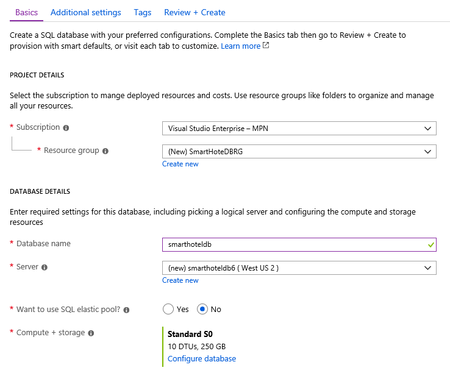

    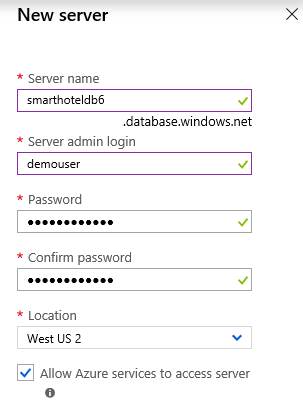

4.  Click **Review + Create**, then click **Create** to create the database. Wait for the deployment to complete.
 
> Note: During migration, the existing database schema will be transferred to the Azure SQL Database using the SQL Server Database Migration Assistant (DMA). We will run this on the Hyper-V host. We therefore need to grant access from the Hyper-V host to the Azure SQL server hosting the Azure SQL database.

5.  Browse to the Hyper-V host by searching for **smarthotelhost** in the global search and clicking on the result for the virtual machine.

    

6.  Take a note of the public IP address of the SmartHotelHost VM.

    

7.  Browse to the SQL Server by searching for **smarthoteldb** in the global search and clicking the result for the SQL server (**not** the SQL database).

    

8.  Click **Show firewall settings** to open the SQL server 'Firewalls and virtual networks' blade.

    

9.  Create a new rule, specifying the rule name **Hyper-V host** and the SmartHotelHost VM public IP address noted earlier as both the 'Start IP' and 'End IP'. Click **Save**. When the save operation completes, click **OK**.

    


#### Task summary <!-- omit in toc -->

In this task you created an Azure SQL Database, and enabled network access to the database from the on-premises Hyper-V host.

### Task 2: Assess the on-premises database

In this task you will install and use Microsoft SQL Server Data Migration Assistant (DMA) to assess an on-premises database.

1. From the Azure portal, browse to the Hyper-V host by searching for **smarthotelhost** in the global search and clicking on the result for the virtual machine.

    
   
2. Click **Connect**, then download the RDP file and connect to the VM using user name **demouser** and password **demo@pass123**.
      
3. From within the **SmartHotelHost** VM, launch file explorer and navigate to **C:\\OpsgilityTraining**.

4. Double click on **DataMigrationAssistant** and follow the instructions to complete the install.

5. From within **SmartHotelHost** launch **Microsoft Data Migration Assistant** using the desktop icon. 

6. In the Data Migration Assistant, select the New (+) icon, and then select the **Assessment** project type.

7. Specify a project name (*e.g.* SmartHotelAssessment), in the **Source server type** text box select **SQL Server**, in the **Target server type** text box, select **Azure SQL Database**, and then select **Create** to create the project.

    

8. On the **Options** tab click **Next**.

9.  On the **Select sources** screen, in the **Connect to a server** dialog box, provide the connection details to the SQL Server, and then select **Connect**.

    - Server name: **192.168.0.6**
    - Authentication type: **SQL Server Authentication**
    - Username: **sa**
    - Password: **demo@pass123**
    - Encrypt connection: **Checked**
    - Trust server certificate: **Checked**

    

10. In the **Add sources** dialog box, select **SmartHotel.Registration**, then click **Add**.

    

11. Click **Start Assessment** to start the assessment. 
    
    

12. **Wait** for the assessment to complete, and review the results. The results should show one unsupported feature, 'Service Broker feature is not supported in Azure SQL Database'. For this migration, we can ignore this issue.

> **Note**: For Azure SQL Database, the assessments identify feature parity issues and migration blocking issues.
>- The SQL Server feature parity category provides a comprehensive set of recommendations, alternative approaches available in Azure, and mitigating steps to help you plan the effort into your migration projects.
>- The Compatibility issues category identifies partially supported or unsupported features that reflect compatibility issues that might block migrating on-premises SQL Server database(s) to Azure SQL Database. Recommendations are also provided to help you address those issues.

#### Task summary <!-- omit in toc -->

In this task you used Data Migration Assistant to assess an on-premises database for readiness to migrate to Azure SQL.

### Task 3: Migrate On-premises database schema

In this task you will use Microsoft Data Migration Assistant to migrate the database schema to Azure SQL Database. This is a prerequisite to migrating the database contents with the Azure Database Migration Service.

1. In the Data Migration Assistant, select the New (+) icon, and then under **Project type**, select **Migration**.

2. Specify a project name (*e.g.* SmartHotelMigration), in the **Source server type** text box, select **SQL Server** and then in the **Target server type** text box, select **Azure SQL Database**. Under **Migration Scope** select **Schema only**. Click **Create**.

    

3. In the Data Migration Assistant, on the **Select source** tab, specify the source connection details for the on-premises SQL Server, then click **Connect**, 

    - Server name: **192.168.0.6**
    - Authentication type: **SQL Server Authentication**
    - Username: **sa**
    - Password: **demo@pass123**
    - Encrypt connection: **Checked**
    - Trust server certificate: **Checked**

    

4. Select the **SmartHotel.Registration** database (if it is not selected already). Un-check the **Assess database before migration?** checkbox. Then click **Next**.

    

5. On the **Select target** tab, specify the target connection details for the Azure SQL database:

    - Server name: **value from Azure - see Note below**
    - Authentication type: **SQL Server Authentication**
    - Username: **demouser**
    - Password: **demo@pass123**
    - Encrypt connection: **Checked**
    - Trust server certificate: **Checked**
    
    Click **Connect**.
    
    

    > Note: To find the Azure SQL Database server name, use the Azure portal to search for **SmartHotelDB** in the global search, then open the SQL Database resource. The server name is shown in the resource properties.

    

    

6. Verify that the **smarthoteldb** database is selected, then click **Next**.

    

7. The **Select objects** tab allows you to specify the schema objects in the **SmartHotel.Registration** database that need to be deployed to Azure SQL Database. Select the **Bookings** table and unselect the **_MigrationHistory** table. Then click **Generate SQL script**.

    

8. The script to migrate the schema to Azure SQL Database is shown on the **Script & deploy schema** tab. Review the script and select **Deploy schema** to deploy the schema to Azure SQL Database. Under **Deployment results**, verify that the script executed successfully.

    

#### Task summary <!-- omit in toc -->

In this task you used Microsoft Data Migration Assistant to migrate the database schema to Azure SQL. This is a prerequisite to migrating the database contents with the Azure Database Migration Service.

### Task 4: Register the Microsoft.DataMigration resource provider

Prior to using the Azure Database Migration Service, the resource provider **Microsoft.DataMigration** must be registered in the target subscription.

1. In the Azure portal, select **All services**, and then select **Subscriptions**.

    

2. Select the subscription in which you want to create the instance of the Azure Database Migration Service. You may need to un-check the global subscription filter to see all your subscriptions.

    

3. In the subscription blade, select **Resource providers**. Search for **migration** and select **Microsoft.DataMigration**. If the resource provider status is unregistered, click **Register**.

    

    > **Note**: It can take several minutes for the provider to register. You cannot proceed until registration is completed. Click **Refresh** periodically to check the progress.

    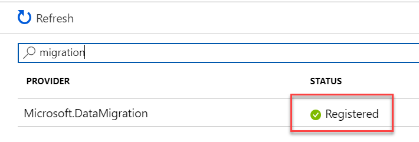

#### Task summary <!-- omit in toc -->

In this task you registered the **Microsoft.DataMigration** resource provider with your subscription. This enables this subscription to use the Azure Database Migration Service.

### Task 5: Create the Database Migration Service

In this task you will create an Azure Database Migration Service resource.

> **Note:** The Azure Database Migrate Service (DMS) requires network access to your on-premises database to retrieve the data to transfer. To achieve this access, the DMS is deployed into an Azure VNet. You are then responsible for connecting that VNet securely to your database, for example by using a Site-to-Site VPN or ExpressRoute connection.
> 
> In this lab, the 'on-presmises' environment is simulated by a Hyper-V host running in an Azure VM. This VM is deployed to the 'smarthotelvnet' VNet. The DMS will be deployed to a separate VNet called 'DMSVnet'. To simulate the on-premises connection, these two VNet have been peered.

1. In the Azure portal, select **+ Create a resource**, search for **migration**, and then select **Azure Database Migration Service** from the drop-down list.

2. On the **Azure Database Migration Service** blade click **Create**.

    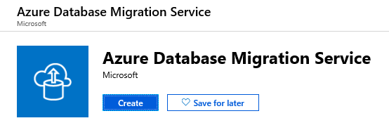

   > Tip: If the migration service blade will not load, refresh the portal blade in your browser.

3. In the **Create Migration Service** blade enter the following values and click **Create**.

    - Service Name: **SmartHotelDBMigration**
    - Subscription: **Select your Azure subscription**
    - Resource group: **SmartHotelDBRG**
    - Location: **Choose the same region as the SmartHotel host**
    - Virtual network: Choose the existing **DMSvnet/DMS** virtual network and subnet.
    - Pricing tier: **Standard: 1 vCore**

    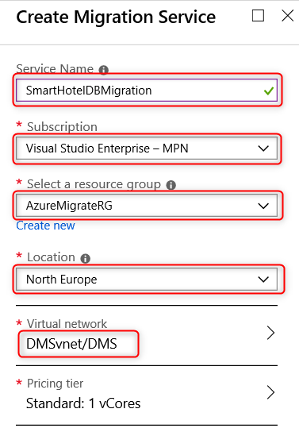

    > **Note**: Creating a new migration service can take up to 30 minutes. Wait for provisioning to complete before moving on to the next task.

#### Task summary <!-- omit in toc -->

In this task you created a new Azure Database Migration Service resource.

### Task 6: Migrate the on-premises data

In this task you will create a migration project in the Azure Database Migration Service and initiate a database migration for an on-premises database to Azure SQL Database.

1. Browse to your migration service in the Azure portal by clicking **All resources** and selecting **SmartHotelDBMigration**.

2. Create a new **Migration Project** by clicking the **+New Migration Project** button.

    

3. Enter a project name (*e.g.* SmartHotelMigration). Select **SQL Server** as the *Source server type* and **Azure SQL Database** as the *Target server type*. Click **Create and run activity**.

    

> Note: We will connect the DMS service to the Hyper-V host (10.0.0.4). This host has been pre-configured with a NAT rule to forward incoming SQL requests (TCP port 1433) to the SQL Server VM. In a real-world migration, the SQL Server VM would most likely have its own IP address on the internal network, via an external Hyper-V switch.

4. In the **Migration source detail** blade, enter the following values and click **Save**.

    - Source SQL Server instance instance name: **10.0.0.4**
    - Authentication type: **SQL Authentication**
    - User Name: **sa**
    - Password: **demo@pass123**
    - Encrypt connection: **Checked**
    - Trust server certificate: **Checked**

    

5. In the **Migration target details** pane, enter the following values and click **Save**.

    - Target server name: **Value from your database, {something}.database.windows.net**
    - Authentication type: **SQL Authentication**
    - User Name: **demouser**
    - Password: **demo@pass123**
    - Encrypt connection: **Checked**

    

    > **Note**: You can find the target server name in the Azure portal by browsing to your database.

    

6. The **Map to target databases** step allows you to specify which source database should be migrated to which target databas (DMS supports migrating multiple databases in a single migration project). Select **SmartHotel.Registration** for the *Source database* and **smarthoteldb** for the *Target database*. Click **Save**.

    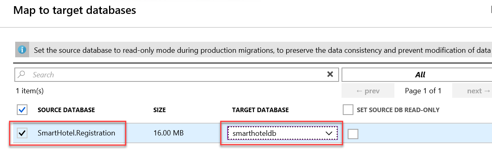
        
7. The **Select tables** step allows you to specify which tables should have their data migrated. Select the **Bookings** table and click **Save**.

    

8. In the **Migration summary** pane, enter an **Activity name** (*e.g.* SmartHotelMigrateActivity) and select **Do not validate** for the **Validation option**. Click **Run migration**.

    

9. On the **Activity** pane, you can view the progress of the migration activity. Click **Refresh** to update the status.

    

    > **Note:** You do **not** need to wait for the migration to complete. You may proceed to the next exercise.

### Exercise summary <!-- omit in toc -->

In this exercise you migrated the application database from on-premises to Azure SQL Database using the Azure Database Migration Service and SQL Server Data Migration Assistant.


## Exercise 3: Migrate the application and web tiers using Azure Site Recovery

Duration: 90 minutes

In this exercise you will migrate the web tier and application tiers of the application from on-premises to Azure using Azure Site Recovery. You will then perform a test failover of the application. The test servers will be reconfigured to use the application database hosted in Azure SQL.

### Task 1: Create a Storage Account

In this task you will create a new Azure Storage Account that will be used by Azure Site Recovery for storage of your virtual machine data during migration.

1. In the Azure portal, click **+Create a resource**, then select **Storage**, followed by **Storage account**.

    

1. In the **Create storage account** blade on the **Basics** tab, use the following values:

    - Subscription: **Select your Azure subscription**
    - Resource group (create new): **VaultRG**
    - Storage account name: **vaultstorage\[unique number\]**
    - Location: **Select the same location as your Azure SQL Database**
    - Account kind: **Storage (general purpose v1)** (do not use a v2 account)
    - Replication: **Locally-redundant storage (LRS)**

    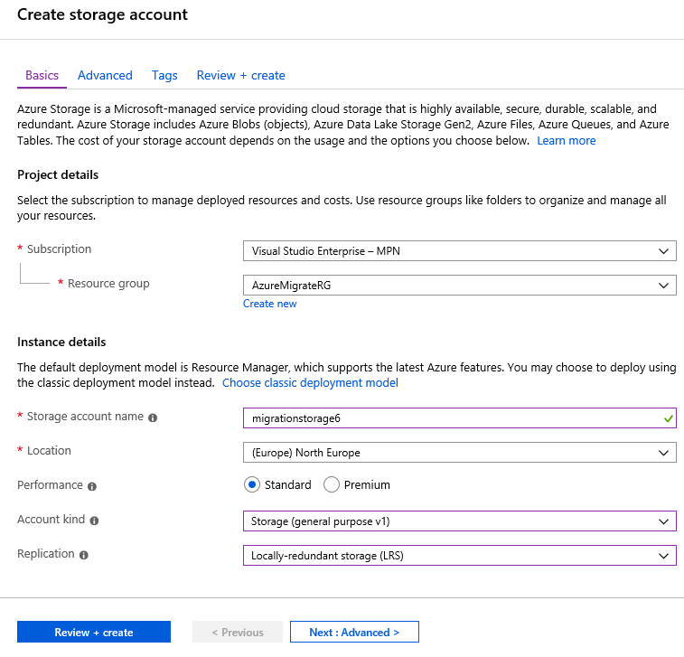

2. Click **Review + create**, then click **Create**.

#### Task summary <!-- omit in toc -->

In this task you created a new Azure Storage Account that will be used by Azure Site Recovery.

### Task 2: Create a Recovery Services Vault

In this task you will create a new Recovery Services Vault that will be used to migrate your virtual machines from on-premises to Azure. A Recovery Services Vault is the resource type used by both the Azure Site Recovery and Azure Backup services.

1. In the Azure portal, click **+Create a resource**, then select **Storage**, followed by **Backup and Site Recovery (OMS)**.

    

2. In the **Recovery Services vault** blade, enter the following values and click **Create**.

    - Name: **Vault**
    - Subscription: **Select your Azure subscription**
    - Resource group: **VaultRG**
    - Location: **Select the same location as your Azure SQL Database**

    

#### Task summary <!-- omit in toc -->

In this task you created a new Recovery Services Vault that will be used to migrate your virtual machines from on-premises to Azure.

### Task 3: Create a Virtual Network

In this task you will create a new virtual network that will be used by your migrated virtual machines when they are migrated to Azure. (Azure Site Recovery will only create the VMs, their network interfaces, and their disks; all other resources must be staged in advance.)

1. In the Azure portal, click **+Create a resource**, then select **Networking**, followed by **Virtual network**.

    

2. In the **Create virtual network** blade, enter the following values and click **Create**.

    - Name: **SmartHotelASRVNet**
    - Address space: **192.168.0.0/24** 
    - Subscription: **Select your Azure subscription**
    - Resource group: (create new) **SmartHotelASRRG**
    - Location: **Select the same location as your Azure SQL Database**
    - Subnet: **SmartHotel**
    - Subnet address range: **192.168.0.0/24**

    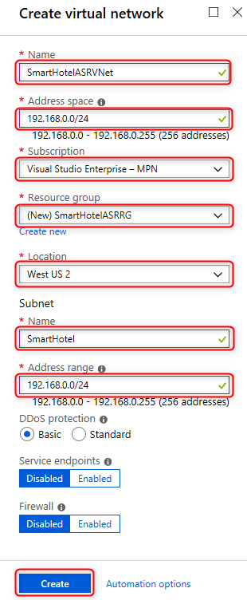

#### Task summary <!-- omit in toc -->

In this task you created a new virtual network that will be used by your virtual machines when they are migrated to Azure. 

### Task 4: Prepare On-premises Virtual Machines

In this task you will install the Azure Virtual Machine Agent (VM Agent) on your on-premises servers prior to migration. 

> **Note:** The Microsoft Azure Virtual Machine Agent (VM Agent) is a secure, lightweight process that manages virtual machine (VM) interaction with the Azure Fabric Controller. The VM Agent has a primary role in enabling and executing Azure virtual machine extensions. VM Extensions enable post-deployment configuration of VM, such as installing and configuring software. VM extensions also enable recovery features such as resetting the administrative password of a VM. Without the Azure VM Agent, VM extensions cannot be used.
>
> We will install the VM agent on the Hyper-V VMs before they are migrated. You can also install the agent after migration.

1.  Using the Azure portal, navigate to the **SmartHotelHost** VM, then click **Connect** and open an RDP session to the VM using the user name **demouser** and password **demo@pass123**.

2.  Open **Hyper-V Manager**, either from the Start menu or by opening Server Manager and using the 'tools' menu.

3.  In Hyper-V Manager, click on **SmartHotelWeb1**, then click **Connect**. This opens a new session with the SmartHotelWeb1 VM. Log in to the Administrator account using password **demo@pass123**.

4.  Open a web browser and download the VM Agent from:

    ```
    https://go.microsoft.com/fwlink/?LinkID=394789
    ```

5.  After the installer has downloaded, run it. Click **Next**, **I accept the terms in the License Agreement**, and then **Next** again. Click **Finish**.

    

6.  Close the smarthotelweb1 window. Repeat the Azure VM agent installation process on **SmartHotelWeb2**.

> Note: There is no need to install the Azure VM agent on the **smarthotelSQL1** VM, since the SmartHotel database has been migrated to the Azure SQL Database managed service.

We will now install the Linux version of the Azure VM Agent on the Ubuntu VM. All Linux distributions supports by Azure have integrated the Azure VM Agent into their software repositories, making installation easy in most cases.

7.  In Hyper-V Manager, click on **UbuntuWAF**, then click **Connect...**. This opens a new session with the VM.
   
8.  If prompted, log in to the existing **demouser** account, using password **demo@pass123**.

9.  Click **Activities**, type **shell** into the searchbox, and click on the **Terminal** application.

    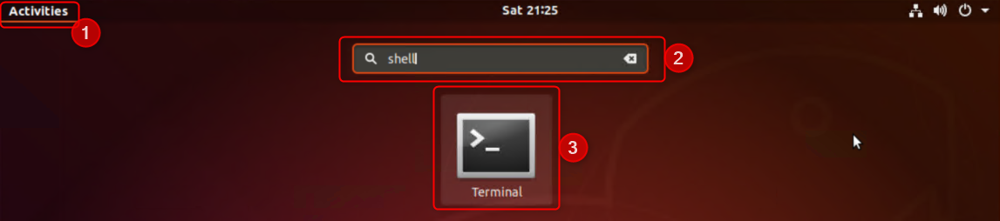

10. In the terminal window, enter the following command:
    ```
    sudo apt-get install walinuxagent
    ```
    When prompted, enter the password **demo@pass123**. At the *Do you want to continue?* prompt, type **Y** and press **Enter**.

    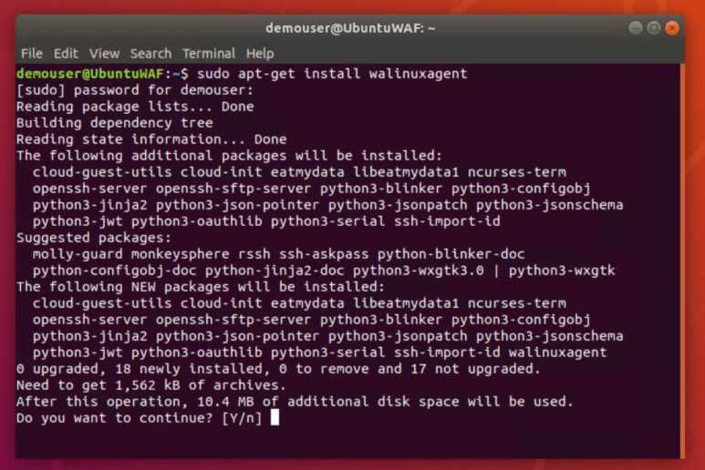

11. Wait for the installer to finish, then close the terminal window and the Ubuntu VM window.

12. Minimize the **SmartHotelHost** remote desktop window, but keep the session open. We'll use it again shortly.

#### Task summary <!-- omit in toc -->

In this task you installed the Azure Virtual Machine Agent (VM Agent) on your on-premises servers prior to migration. 

### Task 5: Configure Azure Site Recovery

In this task you will configure Azure Site Recovery by creating a Hyper-V Site that represents your on-premises environment. You will then begin to replicate your servers to Azure.

1. Open the Azure portal and browse to your Recovery Services Vault.

2. From the vault, select **Site recovery** under **Getting started**, then click **Prepare Infrastructure**.

    

3. The **Prepare Infrastructure** wizard opens. On the **Protection goal** blade, select the following values and click **OK**.   
    - Where are your machines located? **On-premises**
    - Where to you want to replicate your machines to? **To Azure**
    - Are your machines virtualized? **Yes, with Hyper-V**
    - Are you using System Center VMM to manage your Hyper-V hosts? **No**

    
    
4. On the **Deployment planning** blade, select **I will do it later** for the question **Have you completed deployment planning**. Click **OK**.

    **Note**: When you're planning a large deployment, you should make sure you complete deployment planning for Hyper-V replication. More information can be found at <https://docs.microsoft.com/azure/site-recovery/hyper-v-deployment-planner-overview>.
    
5. On the **Prepare source** blade click **+ Hyper-V Site**. Enter **SmartHotelSite** for the **Name** and click **OK**.

   

6. Click **+ Hyper-V Server**. In the **Add Server** blade, right-click the Download link for the Microsoft Azure Site Recovery Provider installer, and copy the link to the clipboard. Open the SmartHotelHost remote desktop window, launch **Chrom,e** from the desktop shortcut, and paste the link into a new browser tab to download the Azure Site Recovery provider installer.

   Return to your browser and download the vault registration key. Save the file locally, then copy the file and paste it to the desktop of the SmartHotelHost in the remote desktop window.

    

7. Run **AzureSiteRecoveryProvider.exe**. On the **Microsoft Update** tab, select **Off** and click **Next**. Accept the default installation location and click **Install**.

    

8.  When the installation has completed click **Register**. Browse to the location of the key file you downloaded. When the key is loaded click **Next**.

    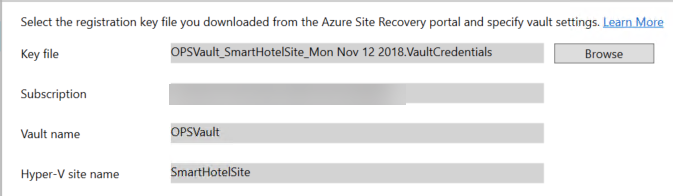

9.  Select **Connect directly to Azure Site Recovery without a proxy server** and click **Next**. On the **Proxy Settings** tab, click **Next** again. The registration of the Hyper-V host with Azure Site Recovery will begin.

10. Wait for registration to complete, then click **Finish**.

    

    > **Note:** The **OK** button on the **Prepare source** blade should become enabled once the metadata is loaded into Azure. Sometimes this takes a long time or doesn't happen.
    >
    > **Tip**: Open a new browser tab, open the Azure portal, and browse to your Recovery Services Vault. Click **Site Recovery Infrastructure**, then click **Hyper-V Hosts**. If the SmartHotelHost is listed, you can close the wizard and then run the **Getting started > Site Recovery** wizard again.

11. Click **OK** on the **Prepare Source** blade, once the button is enabled.

    

12. In the **Target** blade, select your Azure subscription, then click **OK**. 

    > **Note**: You do not need to add a storage account or create a virtual network. You performed these steps earlier in this exercise.

    

13. In the **Replication policy** blade click **+ Create and Associate**. In the **Create and associate policy** blade enter the following values and leave the defaults for the remaining values.

    - Name: **SmartHotelReplicationPolicy**

    

14. Click **OK** and wait for the policy to associate. This can take several minutes.
    
    > **Note:** When you create a new replication policy, it's automatically associated with the specified Hyper-V site (*e.g.* SmartHotelSite).

15. After the policy is created click **OK** on the **Replication policy** blade.

    

16. Click **OK** again to complete the **Prepare infrastructure** wizard. 

    

17. Click **Step 1: Replicate Application** button to open the **Enable replication** wizard. The **Source** blade (step 1) will also open. In the **Source** blade select **On-premises** for the **Source** and **SmartHotelSite** for the **Source location**. Click **OK**.

    

18. Complete the **Target** blade as follows, then click **OK**.
    - Post-failover resource group: **SmartHotelASRRG**
    - Storage account: **vaultstorage\[unique\]**
    - Post-failover Azure network: **SmartHotelASRVNet**
    - Subnet: **SmartHotel (192.168.0.0/24)**

    

19. On the **Select virtual machines** blade, select **UbuntuWAF**, **SmartHotelWeb1** and **SmartHotelWeb2**. Click **OK**.

    

20. On the **Configure properties** blade, select **Windows** as the **OS Type** for the **Defaults** setting and for the **smarthotelweb1** and **smarthotelweb2** VMs. Select **Linux** for the **UbuntuWAF** VM. Click **OK**.

    

21. On the **Configure replication settings** blade click **OK**.

    

22. This completes the *Enable replication* wizard. Click **Enable replication**.

    


23. From the Recovery Services Vault you can click on **Site Recovery Jobs** to view the status of the jobs to enable replication on your virtual machines.

    

#### Task summary <!-- omit in toc -->

In this task you configured Azure Site Recovery by creating a Hyper-V Site that represents your on-premises environment. You then began to replicate your servers to Azure.

### Task 6: Create a Recovery Plan

In this task you will create a recovery plan. This recovery plan will be used to test the migration of your virtual machines and controls settings such as the start order for VMs.

1. In your recovery services vault click **Recovery Plans (Site Recovery)** under the **Manage** heading. Then click **+ Recovery plan**.

    

1. Fill in the **Create recovery plan** blade as follows:
   
   - Name: **SmartHotelRecovery**
   - Allow items with deployment model: **Resource Manager**
   - Select items: Open blade and select **smarthotelweb1**, **smarthotelweb2** and **UbuntuWAF**
  
   Click **OK** twice, and wait for the plan to be created.

    

2. Select the **SmartHotelRecovery** plan. Click **Customize**.

    

3. Expand **Group 1: Start** and click the ellipsis (**...**) for **smarthotelweb2**. Click **Delete machine**.

    

4. Click **+ Group** and the ellipsis (**...**) by **Group 2: Start**. Click **Add protected items**. Select **smarthotelweb2** and click **OK**.

    

5. Click **Save**, then close the recovery plan blade.

    

#### Task summary <!-- omit in toc -->

In this task you created a recovery plan to control the start order of your virtual machines on failover.

### Task 7: Configure Azure VM settings

By default, Azure Site Recovery uses unmanaged disks when creating VMs in Azure. This is because when using Azure Site Recovery for disaster recovery, fail-back to on-premises environments is only support with unmanaged disks. For migration, fail-back is not a concern and so using managed disks is preferable.

In this task, you will change the replication settings for each Azure VM to use Managed Disks. You will also configure the internal IP address used by each VM, and review the VM size.

1.  Navigate to the Recovery Service Vault blade for your vault, then click **Replicated items**. Click on the **UbuntuWAF** VM to open the replication settings for this VM. 

    

2.  Click **Compute and Network**, then click **Edit**.

    

3.  Change the **Use managed disks** setting to **Yes**. Review the VM size is **F2s_v2 (2 cores, 4GB memory, 1 NICs)**, and if necessary, change it.
   
    > **Note:**  You can also use this blade to change other settings, such as the availability set.

    

4.  Under **Network Interfaces**, click on **InternalNATSwitch** to open the network Interface settings.

    

5.  Change the **Private IP address** to **192.168.0.8**.

    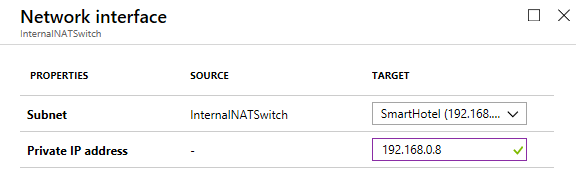

6.  Click **OK** to close the network interface settings blade, then **Save** the UbuntuWAF settings.

6.  Repeat these steps to configure managed disks for the other VMs.
    - For **smarthotelweb1** use private IP address **192.168.0.4**.
    - For **smarthotelweb2** use private IP address **192.168.0.5**.

#### Task summary <!-- omit in toc -->

In this task you modified the replication settings for each VM to use managed disks in Azure, and configured their private IP addresses to match their on-premises IP addresses.

> **Note:** Azure Site Recovery made a "best guess" at the VM settings, but you have full control over the size and settings of migrated items. Setting the private IP address helps us ensure our virtual machines in Azure retain the same IPs they had on-premises, which avoids having to reconfigure the VMs during migration (for example, by editing web.config files).

### Task 8: Test Failover

In this task you will perform a test failover of the SmartHotelWeb* virtual machines and configure the machines to point to the previously migrated Azure SQL Database.

1. Click **Replicated items** under **Protected items** to view the status of replication for your virtual machines. Verify they have a status of **Protected**. 

    

    > **Note**: If the virtual machines are still synchronizing, wait for replication to finish before moving on to the next step.

6. Click on **Recovery Plans (Site Recovery)** and select the **SmartHotelRecovery** plan. Click **Test failover**.

    

7. In the **Test failover** blade, change **Recovery point** to **Latest (lowest RPO)** and select the **Azure virtual network** **SmartHotelASRVNet**. Click **OK**.

    

8. Click the notification for **Test failover of 'SmartHotelRecovery' is in progress** to view the status of the failover.

    

    

   **Wait for the test failover to complete before continuing to the next task.**

   > **Note**: The test failover can take up to 30 minutes to complete for all machines.

9. Navigate to the **SmartHotelASRRG** resource group and check that the VM, network interface, and disk resources have been created for each of the virtual machines being migrated.

   > **Note:** Because this is a test failover, the virtual machine names have had the suffix **-test** appended.

   

#### Task summary <!-- omit in toc -->

In this task you used Azure Site Recovery to perform a test failover. This migrated your on-premises VMs to Azure.

### Task 9: Configure database connection

The application tier VM **smarthotelweb2** is configured to connect to the application database running on the **smarthotelsql** VM. 

On the migrated VM **smarthotelweb2-test**, this configuration needs to be updated to use the Azure SQL Database.

As a preliminary step, you will temporarily associate a public IP address with the **smarthotelweb2** VM, so that you can connect to it using Remote Desktop. (Alternatively, your could connect via a separate 'jumppbox' VM or via a Site-to-Site or ExpressRoute connection.)

> **Note:** You do not need to update any configuration files on **smarthotelweb1-test** or the **UbuntuWAF-test** VMs, since the migration has preserved the private IP addresses of all virtual machines they connect with.

1.  Click **+ Create a resource** and enter **Public IP Address** in the search box. In the **Public IP Address** blade click **Create**.

    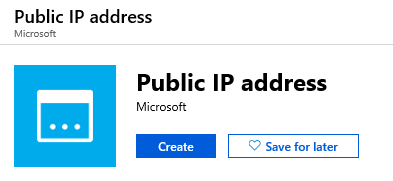

2.  Create a new public IP address with the following values (plus defaults) and click **Create**.

    - Name: **smarthotel-ip**
    - Resource group: **SmartHotelASRRG**
    - Location: **Select the same location as the smarthotelweb2-test VM**

    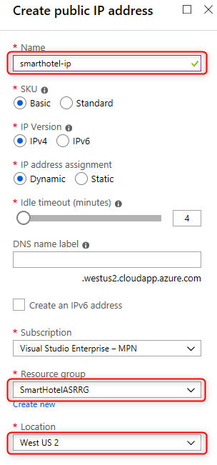


3.  Browse to the **SmartHotelWeb2-test** VM, click **Networking**, and then click the name of the **Network interface** associated with the virtual machine.

    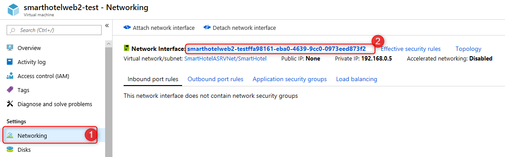

4.  In the network interface settings, click **IP configurations** and then click on the available configuration.

    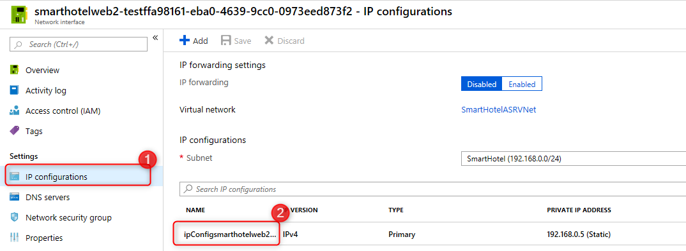

5.  Change the **Public IP address** to **Enabled**, select **smarthotel-ip** and click **Save**.

    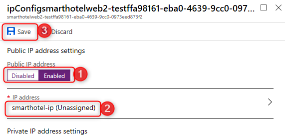

6.  Return to the **SmartHotelWeb2-test** VM overview blade, and click **Connect**. Download the RDP file and connect to the machine with the username **Administrator** and the password **demo@pass123**.

    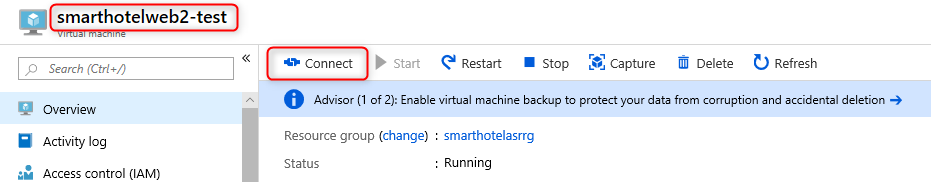

7.  Open Windows Explorer and navigate to the **C:\inetpub\SmartHotel.Registration.Wcf** folder. Double-click the **Web.config** file and open with Notepad.

8.  Update the **DefaultConnection** setting to connect to your Azure SQL Database.

    You can find the connection string for the Azure SQL Database in the Azure portal by browsing to the database, and clicking **Show database connection strings**

     

    Copy the connection string, and paste into the web.config file on **smarthotelweb2-test**, replacing the existing connection string.
    
    Make the following changes to the connection string:
    - Set the User ID to **demouser**.
    - Set the Password to **demo@pass123**.
    - Append the following text to the end of the connection string (immediately before the closing quotes): **" providerName="System.Data.SqlClient**

    
    

9.  Save the web.config file and exit your RDP session.

10. Browse to **SmartHotelWeb2-test**, click **Networking**, and then click the name of the **Network interface** associated with the virtual machine.

    

11. In the network interface settings, click **IP configurations** and then click on the available configuration.

    

12. Change the **Public IP address** to **Disabled** and click **Save**.

    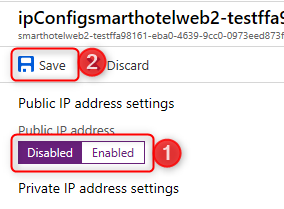

#### Task summary <!-- omit in toc -->

In this task, you updated the **smarthotelweb2-test** configuration to connect to the Azure SQL Database.

### Task 10: Configure public IP and test application

In this task, you will associate the public IP address with the UbuntuWAF VM. This will allow you to verify that the SmartHotel application is running in Azure.

1.  Using similar steps, associate the public IP address resource **smarthotel-ip** with the network interface of the **UbuntuWAF-test** VM.

    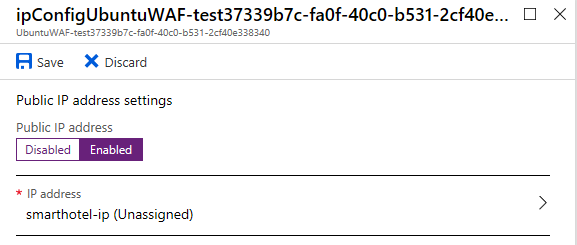

2.  Return to the **UbuntuWAF-test** VM overview blade and copy the **Public IP address** value.

    

3.  Open a new browser tab and paste the IP address. Verify that the SmartHotel360 application is available in Azure.

    

    > **Note**: If you see the default IIS web application, the default site started before SmartHotel.Registration. RDP to the **smarthotelweb1-test** server (you will need to add a public IP address first), open IIS Manager, stop the default site and start the SmartHotel.Registration site.

#### Task summary <!-- omit in toc -->

In this task you configured the public IP address for the SmartHotel application and verified that the migrated site is working.

### Task 11: Cleanup the test failover

In this task you will cleanup the test failover of the application. This deletes the resources created during the test failover and marks the test failover as complete.

1. Navigate to your Recovery Services Vault in the Azure portal. Click on **Recovery Plans (Site Recovery)** and select the **SmartHotelRecovery** plan. Click **Cleanup test failover**.

    

2. On the **Test failover cleanup** blade, check the **Testing is complete. Delete test failover virtual machine(s).** checkbox and click **OK**.

    


#### Task summary <!-- omit in toc -->

In this task, you completed the test failover process by cleaning up the test failover resources.

## After the hands-on lab 

Duration: 10 minutes

### Task 1: Clean up resources

Failure to delete the resources created during the lab will result in continued billing.

1.  Delete the resource group containing the SmartHotelHost.

2.  Delete the **SmartHotelDBRG** resource group containing the Azure SQL Database.

3.  Delete the **VaultRG** resource group containing the Recovery Services Vault.
   
4.  Delete the **SmartHotelASRRG** resource group containing the migrated VMs and related infrastructure resources.
   
5.  Delete the **AzureMigrateRG** resource group containing the Azure Migrate resources.


You should complete all of these steps *after* attending the Hands-on lab.

