<div class="MCWHeader1">
Line-of-business application migration
</div>

<div class="MCWHeader2">
Hands-on lab step-by-step
</div>

<div class="MCWHeader3">
October 2019
</div>


Information in this document, including URL and other Internet Web site references, is subject to change without notice. Unless otherwise noted, the example companies, organizations, products, domain names, e-mail addresses, logos, people, places, and events depicted herein are fictitious, and no association with any real company, organization, product, domain name, e-mail address, logo, person, place or event is intended or should be inferred. Complying with all applicable copyright laws is the responsibility of the user. Without limiting the rights under copyright, no part of this document may be reproduced, stored in or introduced into a retrieval system, or transmitted in any form or by any means (electronic, mechanical, photocopying, recording, or otherwise), or for any purpose, without the express written permission of Microsoft Corporation.

Microsoft may have patents, patent applications, trademarks, copyrights, or other intellectual property rights covering subject matter in this document. Except as expressly provided in any written license agreement from Microsoft, the furnishing of this document does not give you any license to these patents, trademarks, copyrights, or other intellectual property.

The names of manufacturers, products, or URLs are provided for informational purposes only and Microsoft makes no representations and warranties, either expressed, implied, or statutory, regarding these manufacturers or the use of the products with any Microsoft technologies. The inclusion of a manufacturer or product does not imply endorsement of Microsoft of the manufacturer or product. Links may be provided to third party sites. Such sites are not under the control of Microsoft and Microsoft is not responsible for the contents of any linked site or any link contained in a linked site, or any changes or updates to such sites. Microsoft is not responsible for webcasting or any other form of transmission received from any linked site. Microsoft is providing these links to you only as a convenience, and the inclusion of any link does not imply endorsement of Microsoft of the site or the products contained therein.

© 2019 Microsoft Corporation. All rights reserved.

Microsoft and the trademarks listed at <https://www.microsoft.com/en-us/legal/intellectualproperty/Trademarks/Usage/General.aspx> are trademarks of the Microsoft group of companies. All other trademarks are property of their respective owners.

**Contents** 

<!-- TOC -->

- [Line-of-business application migration hands-on lab step-by-step](#line-of-business-application-migration-hands-on-lab-step-by-step)
  - [Abstract and learning objectives](#abstract-and-learning-objectives)
  - [Overview](#overview)
  - [Solution architecture](#solution-architecture)
  - [Requirements](#requirements)
  - [Before the hands-on lab](#before-the-hands-on-lab)
  - [Exercise 1: Discover and assess the on-premises environment](#exercise-1-discover-and-assess-the-on-premises-environment)
    - [Task 1: Create the Azure Migrate project and add assessment and migration tools](#task-1-create-the-azure-migrate-project-and-add-assessment-and-migration-tools)
    - [Task 2: Deploy the Azure Migrate appliance](#task-2-deploy-the-azure-migrate-appliance)
    - [Task 3: Configure the Azure Migrate appliance](#task-3-configure-the-azure-migrate-appliance)
    - [Task 4: Create a migration assessment](#task-4-create-a-migration-assessment)
    - [Task 5: Configure dependency visualization](#task-5-configure-dependency-visualization)
    - [Task 6: Explore dependency visualization](#task-6-explore-dependency-visualization)
  - [Exercise 2: Migrate the Application Database](#exercise-2-migrate-the-application-database)
    - [Overview](#overview-1)
    - [Task 1: Register the Microsoft.DataMigration resource provider](#task-1-register-the-microsoftdatamigration-resource-provider)
    - [Task 2: Create an Azure SQL Database](#task-2-create-an-azure-sql-database)
    - [Task 3: Create the Database Migration Service](#task-3-create-the-database-migration-service)
    - [Task 4: Assess the on-premises database using Data Migration Assistant](#task-4-assess-the-on-premises-database-using-data-migration-assistant)
    - [Task 5: Create a DMS migration project](#task-5-create-a-dms-migration-project)
    - [Task 6: Migrate the database schema](#task-6-migrate-the-database-schema)
    - [Task 7: Migrate the on-premises data](#task-7-migrate-the-on-premises-data)
  - [Exercise 3: Migrate the application and web tiers using Azure Migrate: Server Migration](#exercise-3-migrate-the-application-and-web-tiers-using-azure-migrate-server-migration)
    - [Task 1: Create a Storage Account](#task-1-create-a-storage-account)
    - [Task 2: Create a Virtual Network](#task-2-create-a-virtual-network)
    - [Task 3: Register the Hyper-V Host with Azure Migrate Server Migration](#task-3-register-the-hyper-v-host-with-azure-migrate-server-migration)
    - [Task 4: Enable Replication from Hyper-V to Azure Migrate](#task-4-enable-replication-from-hyper-v-to-azure-migrate)
    - [Task 5: Configure static internal IP addresses for each VM](#task-5-configure-static-internal-ip-addresses-for-each-vm)
    - [Task 6: Server migration](#task-6-server-migration)
    - [Task 7: Configure the database connection](#task-7-configure-the-database-connection)
    - [Task 8: Configure the public IP address and test the SmartHotel application](#task-8-configure-the-public-ip-address-and-test-the-smarthotel-application)
    - [Task 9: Post-migration steps](#task-9-post-migration-steps)
  - [After the hands-on lab](#after-the-hands-on-lab)
    - [Task 1: Clean up resources](#task-1-clean-up-resources)

<!-- /TOC -->

# Line-of-business application migration hands-on lab step-by-step 

## Abstract and learning objectives 

In this hands-on lab, you will learn how to assess and migrate a multi-tier application from Hyper-V to Azure. You will learn how to use Azure Migrate as the hub for executing a migration, together with accompanying tools.

After this hands-on lab, you will know the role of Azure Migrate and related migration tools and how to use them to successfully migrate an on-premises multi-tier application to Azure.

## Overview

Before the lab, you will have pre-deployed an on-premises infrastructure hosted in Hyper-V.  This infrastructure is hosting a multi-tier application called 'SmartHotel', using Hyper-V VMs for each of the application tiers.

During the lab, you will migrate this entire application stack to Azure. This will include assessing the on-premises application using Azure Migrate; assessing the database migration using SQL Server Data Migration Assistant (DMA); migrating the database using the Azure Database Migration Service (DMS); and migrating the web and application tiers using Azure Migrate: Server Migration. This last step includes migration of both Windows and Linux VMs.


## Solution architecture

The SmartHotel application comprises 4 VMs hosted in Hyper-V:

- **Database tier** Hosted on the smarthotelSQL1 VM, which is running Windows Server 2016 and SQL Server 2017
- **Application tier** Hosted on the smarthotelweb2 VM, which is running Windows Server 2012R2.
- **Web tier** Hosted on the smarthotelweb1 VM, which is running Windows Server 2012R2.
- **Web proxy** Hosted on the  UbuntuWAF VM, which is running Nginx on Ubuntu 18.04 LTS.

For simplicity, there is no redundancy in any of the tiers.

>**Note:** For convenience, the Hyper-V host itself is deployed as an Azure VM. For the purposes of the lab, you should think of it as an on-premises machine.

![A slide shows the on-premises SmartHotel application architecture. This comprises a SmartHotelHost server running Microsoft Hyper-V. This server hosts 4 VMs: UbuntuWAF, SmartHotelWeb1, SmartHotelWeb2, and SmartHotelSQL1. A series of arrows show how these VMs will be migrated to Azure. The first 3 VMs have an arrow labeled 'Azure Migrate: Server Migration' pointing to 3 similarly-labeled VMs in Azure. The last VM, SmartHotelSQL1, has an arrow labeled 'Azure Database Migration Service' pointing to an Azure SQL Database. A third arrow labeled 'Azure Migrate: Server Assessment' and 'Data Migration Assistant (DMA)' points from all 4 on-premises VMs to an Azure Migrate dashboard showing migration readiness.](images/overview.png)

Throughout this lab, you will use Azure Migrate as your primary tool for assessment and migration. In conjunction with Azure Migrate, you will also use a range of other tools, as detailed below.

To assess the Hyper-V environment, you will use Azure Migrate: Server Assessment. This includes deploying the Azure Migrate appliance on the Hyper-V host to gather information about the environment. For deeper analysis, the Microsoft Monitoring Agent and Dependency Agent will be installed on the VMs, enabling the Azure Migrate dependency visualization.

The SQL Server database will be assessed by installing the Microsoft SQL Server Data Migration Assistant (DMA) on the Hyper-V host, and using it to gather information about the database. Schema migration and data migration will then be completed using the Azure Database Migration Service (DMS).

The application, web, and web proxy tiers will be migrated to Azure VMs using Azure Migrate: Server Migration. You will walk through the steps of building the Azure environment, replicating data to Azure, customizing VM settings, and performing a failover to migrate the application to Azure.

> **Note:** After migration, the application could be modernized to use Azure Application Gateway instead of the Ubuntu Nginx VM, and to use Azure App Service to host both the web tier and application tier. These optimizations are out of scope of this lab, which is focused only on a 'lift and shift' migration to Azure VMs.

## Requirements

1. You will need Owner or Contributor permissions for an Azure subscription to use in the lab.

2. Your subscription must have sufficient unused quota to deploy the VMs used in this lab.

## Before the hands-on lab

Refer to the [Before the HOL - Line-of-business application migration](./Before%20the%20HOL%20-%20Line-of-business%20application%20migration.md) setup guide manual before continuing to the lab exercises.

**Allow at least 60 minutes to deploy the on-premises environment before you start the lab.**

## Exercise 1: Discover and assess the on-premises environment

Duration: 60 minutes

In this exercise, you will use Azure Migrate: Server Assessment to assess the on-premises environment. This will include selecting Azure Migrate tools, deploying the Azure Migrate appliance into the on-premises environment, creating a migration assessment, and using the Azure Migrate dependency visualization.

### Task 1: Create the Azure Migrate project and add assessment and migration tools

In this task, you will create the Azure Migrate project and select the migration assessment tool.

1. Open your browser, navigate to **https://portal.azure.com**, and log in with your Azure subscription credentials.

2. Select **All services**, then search for and select **Azure Migrate** to open the Azure Migrate Overview blade, shown below.

    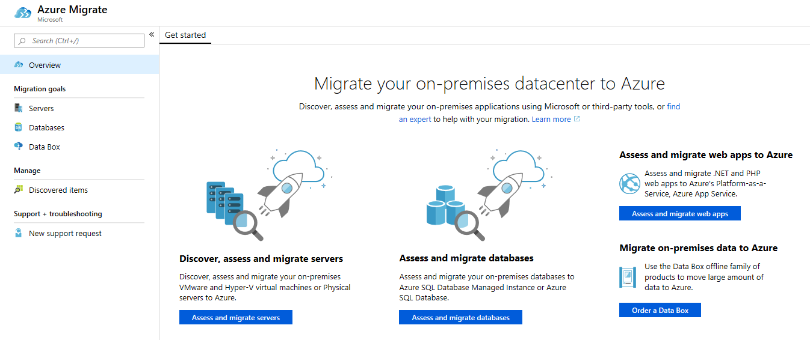

3. Select the **Assess and migrate servers** button, followed by the **Add tool(s)** button, to open the 'Add a tool' wizard at the 'Migrate project' step.  Select your subscription and create a new resource group named **AzureMigrateRG**. Enter **SmartHotelMigration** as the Migrate project name, and choose a geography close to you to store the migration assessment data.

    

    Select **Next**.

4. At the 'Select assessment tool' step, select **Azure Migrate: Server Assessment**, then select **Next**.

    

5. At the 'Select migration tool' step, select **Azure Migrate: Server Migration**, then select **Next**.

    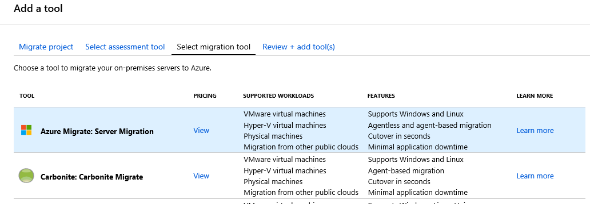

6. At the 'Review + add tool(s)' step, review the settings and select **Add tool(s)**.

    

7. The Azure Migrate deployment will start. Once it has completed, select on the **Servers** panel of the Azure Migrate blade (it may open automatically). You should now see the 'Azure Migrate: Server Assessment' and 'Azure Migrate: Server Migration' panels for the current migration project, as shown below.

    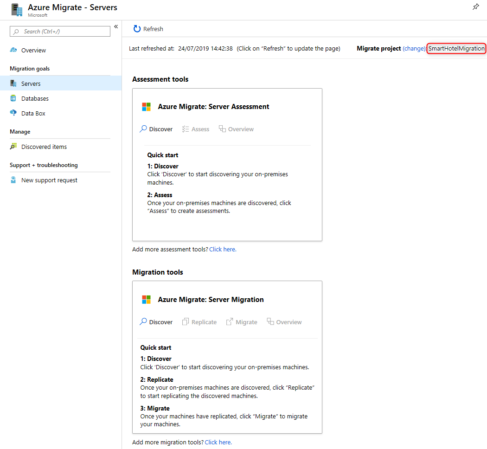

#### Task summary <!-- omit in toc -->

In this task you created an Azure Migrate project, selecting the built-in tools for assessment and migration.

### Task 2: Deploy the Azure Migrate appliance

In this task, you will deploy and configure the Azure Migrate appliance in the on-premises Hyper-V environment. This appliance communicates with the Hyper-V server to gather configuration and performance data about your on-premises VMs.

1. Select **Discover** under 'Azure Migrate: Server Assessment' to open the 'Discover machines' blade. Under 'Are your machines virtualized?', select **Yes, with Hyper-V**.

    

    Read through the instructions on how to download, deploy and configure the Azure Migrate appliance. Close the 'Discover machines' blade (do **not** download the .VHD file, it has already been downloaded for you).

2. In a separate browser tab, navigate to the Azure portal. In the global search box, enter **SmartHotelHost** into the search box, then select on the **SmartHotelHost** virtual machine.

    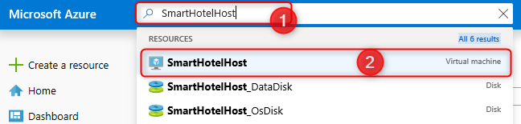

3. Select **Connect**, then download the RDP file and connect to the virtual machine using username **demouser** and password **demo@pass123**.

4. In Server Manager, select **Tools**, then **Hyper-V Manager** (if Server Manager does not open automatically, open it by selecting **Start**, then **Server Manager**). In Hyper-V manager, select **SMARTHOTELHOST**. You should now see a list of the four VMs that comprise the on-premises SmartHotel application.

    

    Before deploying the Azure Migrate appliance virtual machine, you need to create a network switch that it will use to communicate with the Hyper-V host. You could use the existing switch used by the SmartHotel VMs, but since the Azure Migrate appliance does not need to communicate with the SmartHotel VMs directly, you will protect the application environment by creating a separate switch.

5. In Hyper-V Manager, under 'Actions', select **Virtual Switch Manager** to open the Virtual Switch Manager. The 'New virtual network switch' option should already be selected. Under 'Create virtual switch', select **Internal** as the virtual switch type, then select **Create Virtual Switch**.

    

6. A new virtual switch is created. Change the name to **Azure Migrate Switch** (this is important, since a script you will run shortly depends on the name). Then select **OK**.

    

    You will now deploy the Azure Migrate appliance virtual machine.  Normally, you would first need to download the .ZIP file containing the appliance to your Hyper-V host, and unzip it. To save time, these steps have been completed for you.

7. Back in Hyper-V Manager, under 'Actions', select **Import Virtual Machine...** to open the 'Import Virtual Machine' wizard.

    

8. At the first step, 'Before You Begin', select **Next**.

9. At the 'Locate Folder' step, select **Browse** and navigate to **F:\VirtualMachines\AzureMigrateAppliance** (the folder name may also include a version number), then select **Select Folder**, then select **Next**.

    

10. At the 'Select Virtual Machine' step, the **AzureMigrateAppliance** VM should already be selected. Select **Next**.

11. At the 'Choose Import Type' step, keep the default setting **Register the virtual machine in-place**. Select **Next**.

12. At the 'Connect Network' step, you will see an error that the virtual switch previously used by the Azure Migrate appliance could not be found. From the 'Connection' drop down, select the **Azure Migrate Switch** you created earlier, then select **Next**.

    

13. Review the summary page, then select **Finish** to create the Azure Migrate appliance VM.

    Before starting the Azure Migrate appliance, you must configure the network settings. The existing Hyper-V environment has a NAT network using the IP address space 192.168.0.0/16. The internal NAT switch used by the SmartHotel application uses the subnet 192.168.0.0/24, and each VM in the application has been assigned a static IP address from this subnet.

    You will create a new subnet 192.168.1.0/24 within the existing NAT network, with gateway address 192.168.1.1.  These steps will be completed using a PowerShell script. The Azure Migrate appliance will be assigned an IP address from this subnet using a DHCP service running on the SmartHotelHost.

14. Still working within the SmartHotelHost RDP session, open Windows Explorer, and navigate to the folder **C:\OpsgilityTraining**.

15. Right-select on the PowerShell script **ConfigureAzureMigrateApplianceNetwork**, and select **Run with PowerShell**. Answer **Yes** to any PowerShell prompts.

    

    The Azure Migrate appliance is now ready to be started.

16. In Hyper-V Manager, select on the **AzureMigrateAppliance** VM, then select **Start**.

   

#### Task summary <!-- omit in toc -->

In this task you deployed the Azure Migrate appliance in the on-premises Hyper-V environment.

### Task 3: Configure the Azure Migrate appliance

In this task, you will configure the Azure Migrate appliance and use it to complete the discovery phase of the migration assessment.

1. In Hyper-V Manager, select on the **AzureMigrateAppliance** VM, then select **Connect**.

    

2. A new window will open showing the Azure Migrate appliance. Wait for the License terms screen to show, then select **Accept**.

    

3. On the 'Customize settings' screen, set the Administrator password to **demo@pass123** (twice). Then select **Finish**.

    > **Note:** When setting the password, the VM uses a US keyboard mapping. Use **SHIFT + 2** to enter the "@" character, and select on the 'eyeball' icon in the second password entry box to check the password that has been entered.

    

4. At the 'Connect to AzureMigrateAppliance' prompt, set the appliance screen size using the slider, then select **Connect**.

5. Log in with the Administrator password **demo@pass123** (the login screen may pick up your local keyboard mapping, use the 'eyeball' to check).

6. **Wait.** After a minute or two, an Internet Explorer windows will open showing the Azure Migrate appliance configuration wizard. If the 'Set up Internet Explorer 11' prompt is shown, select **OK** to accept the recommended settings. If the Internet Explorer 'Content from the website listed below is being blocked...' prompt is shown, select **Close** and return to the Azure Migrate Appliance browser tab.

    

7. Under **Set up prerequisites**, accept the license terms. The following two steps to verify Internet connectivity and time synchronization should pass automatically.

    

8. **Wait** while the wizard installs the latest Azure Migrate updates. If prompted for credentials, enter user name **Administrator** and password **demo@pass123**. Once the Azure Migrate updates are completed, check at the top of the browser window to see if a management app restart is required, and if so, select the link to restart the app. 

   

   Once restarted, repeat the steps above to complete the 'Set up prerequisites' phase of the Azure Migrate wizard. Select **Continue** to proceed.

   

9. At the next phase of the wizard, 'Register with Azure Migrate', select **Login**. This opens a separate browser tab where you enter your Azure subscription credentials.  

10. Once you have logged in, return to the Azure Migrate Appliance tab and select your subscription and the **SmartHotelRegistration(AzureMigrateRG)** Migrate project using the drop-downs. Enter **SmartHotelAppl** as the appliance name, then select **Register**. After a short pause, the registration should be successful. Select **Continue**.

    

11. In the next step, 'Provide Hyper-V hosts details', enter the user name **demouser** and password **demo@pass123**. These are the credentials for the Hyper-V host. Enter **Host login** as the friendly name, then select **Save details**.

    > **Note:** The Azure Migrate appliance should have picked up your local keyboard mapping. Select the 'eyeball' in the password box to check the password was entered correctly.

    

    The next step is to register the Hyper-V host with the Azure Migrate appliance.

12. Under 'Specify the list of Hyper-V hosts and clusters to discover', select **Add**.

    

13. A window will appear prompting for a list of Hyper-V hosts. Enter the Hyper-V hostname, **SmartHotelHost**. Then select **Validate**.

    > **Note:** The Hyper-V host must be specified using a hostname, and that hostname must resolve to the IP address of the host. The Hyper-V host cannot be specified using an IP address directly.

    

14. A table shows the SmartHotelHost, with status 'green'. Select **Validate** again, and check the status stays green. Then select **Save and start discovery**.

    

15. A message 'Initiating discovery and configuring appliance' is shown.

    

16. **Wait** for the Azure Migrate status to show 'Created Site and initiating discovery'. This will take several minutes.

    

17. Return to the Azure Migrate blade in the Azure portal.  Select on **Servers**, then select **Refresh**.  Under 'Azure Migrate: Server Assessment' you should see a count of the number of servers discovered so far. If discovery is still in progress, select **Refresh** periodically until 5 discovered servers are shown. This may take several minutes.

    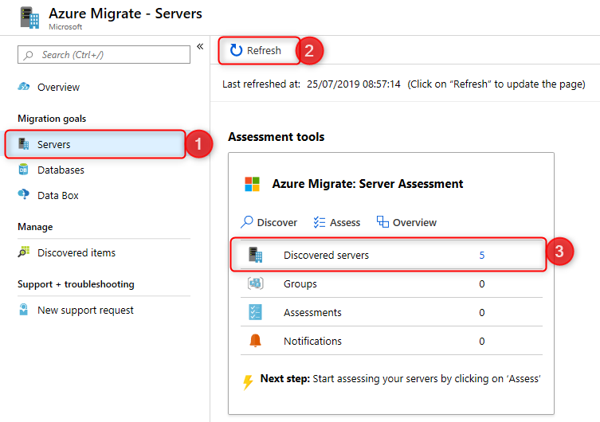

>**Wait for the discovery process to complete before proceeding to the next Task**.

#### Task summary <!-- omit in toc -->

In this task you configured the Azure Migrate appliance in the on-premises Hyper-V environment and started the migration assessment discovery process.

### Task 4: Create a migration assessment

In this task, you will use Azure Migrate to create a migration assessment for the SmartHotel application, using the data gathered during the discovery phase.

1. Continuing from Task 3, select **Assess** to start a new migration assessment.

    

2. On the Assess servers blade, enter **SmartHotelAssessment** as the assessment name.

    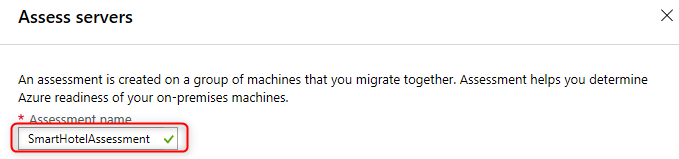

3. Under Assessment properties, select **View all**.

    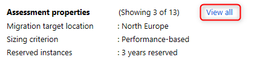

4. The Assessment properties blade allows you to tailor many of the settings used when making a migration assessment report. Take a few moments to explore the wide range of assessment properties. Hover over the information icons to see more details on each setting. Choose any settings you like, then select **Save**. (You have to make a change for the Save button to be enabled; if you don't want to make any changes, just close the blade.)

    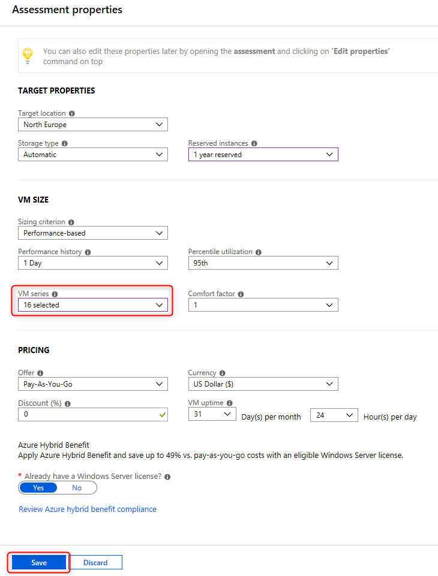

5. On the Assess servers blade, under 'Select or create a group', choose **Create New** and enter the group name **SmartHotel VMs**. Select the **smarthotelweb1**, **smarthotelweb2** and **UbuntuWAF** VMs. Select **Create assessment**.

    

6. On the 'Azure Migrate - Servers' blade, select **Refresh** periodically until the number of assessments shown is **1**. This may take several minutes.

    

7. Select on **Assessments** to see a list of assessments. Then select on the actual assessment.

    

8. Take a moment to study the assessment overview.

    

9. Select on **Edit properties**. Note how you can now modify the assessment properties you chose earlier. Change a selection of settings, and **Save** your changes. After a few moments, the assessment report will update to reflect your changes.

10. Select on **Azure readiness** (either the chart or the left-nav). Note that for each VM, a specific concern is listed regarding the readiness of the VM for migration.

    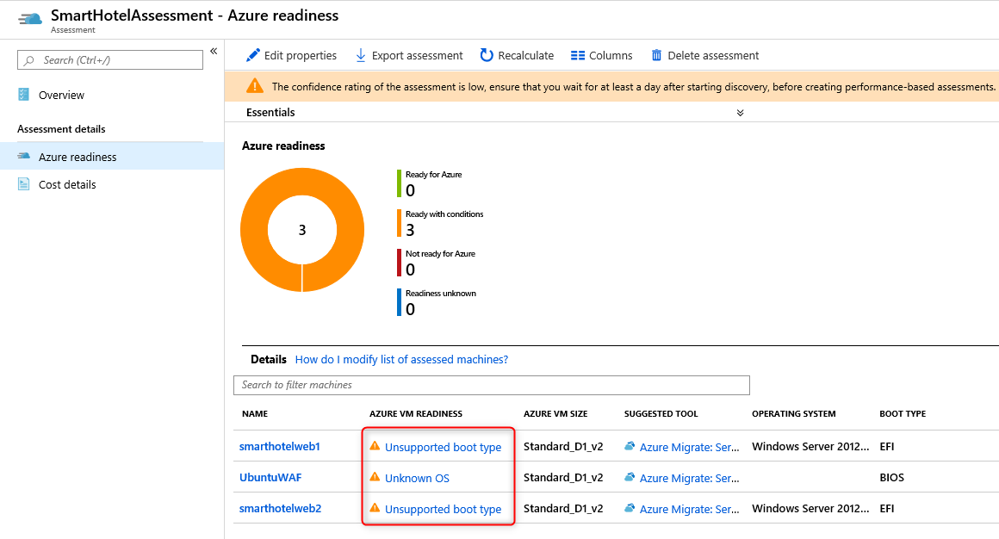

11. Select on **Unsupported boot type** for **smarthotelweb1**. A new browser tab opens showing Azure Migrate documentation. Search for 'Unsupported boot type' and note that the issue relates to EFI boot not being supported, and the recommendation to migrate using Azure Migrate Server Migration, which will convert the boot type to BIOS.

    

12. Return to the portal browser tab to see details of the issue, and once again the suggested to migrate using Azure Migrate Server Migration. (The 'Suggestion' text referring to Azure Site Recovery reflects that Azure Migrate: Server Migration uses Azure Site Recovery under the hood as the migration engine.)

    

13. Take a few minutes to explore other aspects of the migration assessment. Check why the UbuntuWAF is marked as 'conditionally ready for Azure', and explore the costs associated with the migration.

#### Task summary <!-- omit in toc -->

In this task you created and configured an Azure Migrate migration assessment.

### Task 5: Configure dependency visualization

When migrating a workload to Azure, it is important to understand all workload dependencies. A broken dependency could mean that the application doesn't run properly in Azure, perhaps in hard-to-detect ways. Some dependencies, such as those between application tiers, are obvious. Other dependencies, such as DNS lookups, Kerberos ticket validation or certificate revocation checks, are not.

In this task, you will configure the Azure Migrate dependency visualization feature. This requires you to first create a Log Analytics workspace, and then to deploy agents on the to-be-migrated VMs.

1. Return to the Azure Migrate blade in the Azure Portal, and select **Servers**. Under 'Azure Migrate: Server Assessment' select **Groups**, then select the **SmartHotel VMs** group to see the group details. Note that each VM has their 'Dependencies' status as 'Requires agent installation'. Select on **Requires agent installation** for the **smarthotelweb1** VM.

    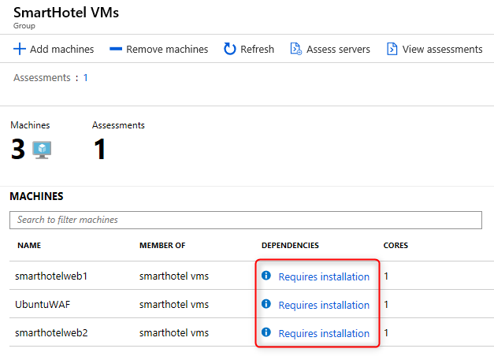

2. On the Dependencies blade, select **Configure OMS workspace**.

    

3. Create a new OMS workspace. Use **AzureMigrateWorkspace\<unique number\>** as the workspace name, where \<unique number\> is a random number. Choose a workspace location close to your lab deployment, then select **Configure**.

    

4. Wait for the workspace to be deployed. Once it is deployed, make a note of the **Workspace ID** and **Workspace key** (for example by using Notepad).

    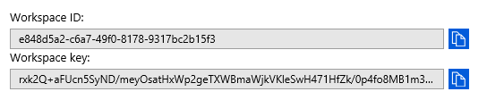

5. Right-select and copy the links for each of the 4 agent installers (the Microsoft Monitoring Agent and the Dependency Agent, for both Windows and Linux). Make a note of each of the links.

    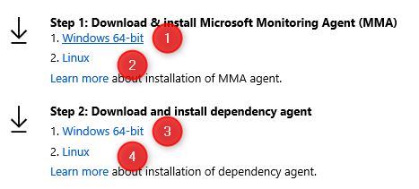

6. Return to the RDP session with the **SmartHotelHost**. In **Hyper-V Manager**, select on **smarthotelweb1** and select **Connect**.

    

7. Log in to the **Administrator** account using the password **demo@pass123**.

8. Open **Internet Explorer**, and paste the link for the Microsoft Monitoring Agent Windows installer into the address bar. **Run** the installer.

    

9. Select through the installation wizard. On the **Agent Setup Options** page, select **Connect the agent to Azure Log Analytics (OMS)**. Enter your Workspace ID and Workspace Key on the next page, and select **Azure Commercial** from the Azure Cloud drop-down. Select through the remaining pages and install the agent.

    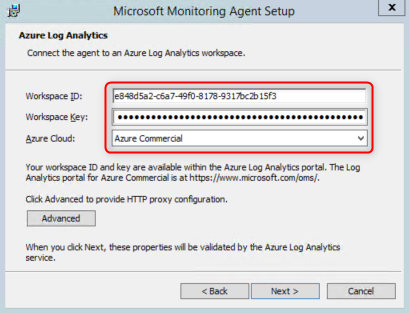

10. Paste the link to the Dependency Agent Windows installer into the browser address bar. **Run** the installer and select through the install wizard to complete the installation.

    

11. Close the virtual machine connection window for the **smarthotelweb1** VM.  Connect to the **smarthotelweb2** VM and repeat the installation process for both agents (the administrator password is the same as for smarthotelweb1).

    You will now deploy the Linux versions of the Microsoft Monitoring Agent and Dependency Agent on the UbuntuWAF VM. To do so, you will first connect to the UbuntuWAF remotely using an SSH session to the IP address of the SmartHotelHost. The SmartHotelHost has been pre-configured with a NAT rule which forwards SSH connections to the UbuntuWAF VM.

12. In the Azure portal, navigate to the SmartHotelHost VM and note the public IP address. Open a new browser tab and navigate to **https://shell.azure.com**, accept any prompts and open a **Bash shell** session (not a PowerShell session).

    

13. Enter the following command, replacing \<ip address\> with the public IP address of the SmartHotelHost:

    ```s
    ssh demouser@<ip address>
    ```

14. Enter 'yes' when prompted whether to connect. Use the password **demo@pass123**.

    

15. Enter the following command, followed by the password **demo@pass123** when prompted:

    ```s
    sudo -s
    ```

    This gives the terminal session elevated privileges.

16. Enter the following command, substituting \<Workspace ID\> and \<Workspace Key\> with the values copied previously:

    ```s
    wget https://raw.githubusercontent.com/Microsoft/OMS-Agent-for-Linux/master/installer/scripts/onboard_agent.sh && sh onboard_agent.sh -w <Workspace ID> -s <Workspace Key>
    ```

17. Enter the following command, substituting \<Workspace ID\> with the value copied previously:

    ```s
    /opt/microsoft/omsagent/bin/service_control restart <Workspace ID>
    ```

18. Enter the following command. This downloads a script that will install the Dependency Agent.

    ```s
    wget --content-disposition https://aka.ms/dependencyagentlinux -O InstallDependencyAgent-Linux64.bin
    ```

19. Install the dependency agent by running the script download in the previous step.

    ```s
    sh InstallDependencyAgent-Linux64.bin -s
    ```

    

20. The agent installation is now complete. Next, you need to generate some traffic on the SmartHotel application so the dependency visualization has some data to work with. Browse to the public IP address of the SmartHotelHost, and spend a few minutes refreshing the page and checking guests in and out.

#### Task summary <!-- omit in toc -->

In this task you configured the Azure Migrate dependency visualization feature, by creating a Log Analytics workspace and deploying the Azure Monitoring Agent and Dependency Agent on both Windows and Linux on-premises machines.

### Task 6: Explore dependency visualization

In this task, you will explore the dependency visualization feature of Azure Migrate. This feature uses data gathered by the dependency agent you installed in Task 5.

1. Return to the Azure Portal and refresh the Azure Migrate **SmartHotel VMs** VM group blade. The 3 VMs on which the dependency agent was installed should now show their status as 'Installed'. (If not, refresh the page **using the browser refresh button**, not the refresh button in the blade.)

    

2. Select on **View dependencies**.

    

3.  Take a few minutes to explore the dependencies view. Expand each server to show the processes running on that server. Select on a process to see process information. See which connections each server makes.

    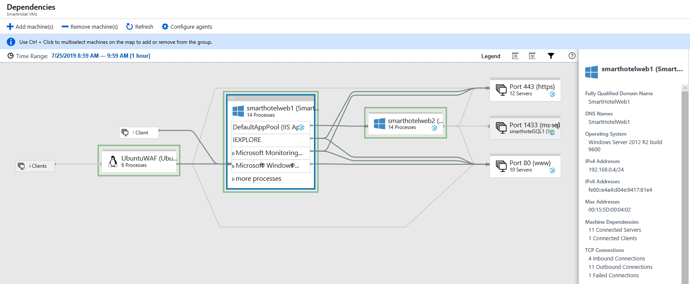

4. Select on the database tile ('Port 1433') then **+ Add machines**. Note how you can add machines to the group this way. Note that you can also remove machines from the group. The dependency visualization is a powerful tool for creating the right VM groups for successful migrations.

    

    **Important:** When you have finished exploring the dependency visualization, make sure your group still contains the original virtual machines (**UbuntuWAF**, **smarthotelweb1**, and **smarthotelweb2**).

#### Task summary <!-- omit in toc -->

In this task you explored the Azure Migrate dependency visualization feature.

### Exercise summary <!-- omit in toc -->

In this exercise, you used Azure Migrate to assess the on-premises environment. This included selecting Azure Migrate tools, deploying the Azure Migrate appliance into the on-premises environment, creating a migration assessment, and using the Azure Migrate dependency visualization.

## Exercise 2: Migrate the Application Database

### Overview

Duration: 60 minutes

In this exercise you will migrate the application database from the on-premises Hyper-V virtual machine to a new database hosted in the Azure SQL Database service. You will use the Azure Database Migration Service to complete the migration, which uses the SQL Server Data Migration Assistant for the database assessment and schema migration phases.

### Task 1: Register the Microsoft.DataMigration resource provider

Prior to using the Azure Database Migration Service, the resource provider **Microsoft.DataMigration** must be registered in the target subscription.

1. In the Azure portal, select **All services**, and then select **Subscriptions**.

    

2. Select the subscription in which you want to create the instance of the Azure Database Migration Service. You may need to un-check the global subscription filter to see all your subscriptions.

    

3. In the subscription blade, select **Resource providers**. Search for **migration** and select **Microsoft.DataMigration**. If the resource provider status is unregistered, select **Register**.

    

    > **Note**: It may take several minutes for the resource provider to register. You can proceed to the next task without waiting for the registration to complete. Keep this browser tab open so you can check the registration status. You will not use the resource provider until task 3.

#### Task summary <!-- omit in toc -->

In this task you registered the **Microsoft.DataMigration** resource provider with your subscription. This enables this subscription to use the Azure Database Migration Service.

### Task 2: Create an Azure SQL Database

In this task you will create a new Azure SQL database to migrate the on-premises database to.

1. Open the Azure portal at https://portal.azure.com and log in using your subscription credentials.

2. Select **+ Create a resource**, then select **Databases**, then select **SQL Database**.

    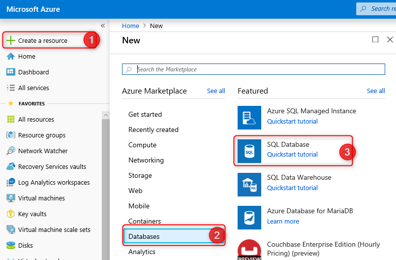

3. The **Create SQL Database** blade opens, showing the 'Basics' tab. Complete the form as follows:

    - Subscription: **Select your subscription**.
    - Resource group (create new): **SmartHotelDBRG**
    - Database name: **smarthoteldb**
    - Server: Select **Create new** and fill in the New server blade as follows:
        - Server name: **smarthoteldb\[unique number\]**
        - Server admin login: **demouser**
        - Password: **demo@pass123**
        - Location: **IMPORTANT: For most users, select the same region you used when you started your lab - this makes migration faster. If you are using an Azure Pass subscription, choose a different region to stay within the Total Regional vCPU limit.**
        - Allow Azure services to access server: **Checked**

    > **Note:** You can verify the location by opening another browser tab, navigating to https://portal.azure.com and selecting Virtual Machines on the left navigation. Use the same region as the **SmartHotelHost** virtual machine.

    - Use SQL elastic pool: **No**
    - Compute + storage: **Standard S0**

    > **Note:** To select the 'Standard S0' database tier, select **Configure database**, then **Looking for basic, standard, premium?**, select **Standard** and select **Apply**.

    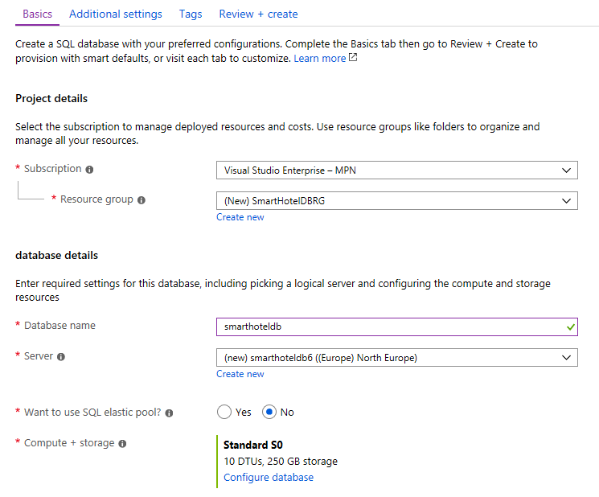

    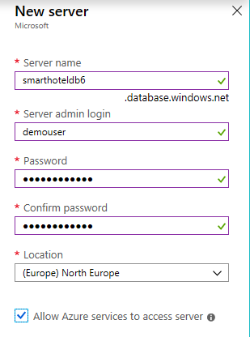

4. Select **Review + Create**, then select **Create** to create the database. Wait for the deployment to complete.

#### Task summary <!-- omit in toc -->

In this task you created an Azure SQL Database running on an Azure SQL Database Server.

### Task 3: Create the Database Migration Service

In this task you will create an Azure Database Migration Service resource. This resource is managed by the Microsoft.DataMigration resource provider which you registered in task 1.

> **Note:** The Azure Database Migrate Service (DMS) requires network access to your on-premises database to retrieve the data to transfer. To achieve this access, the DMS is deployed into an Azure VNet. You are then responsible for connecting that VNet securely to your database, for example by using a Site-to-Site VPN or ExpressRoute connection.
>
> In this lab, the 'on-premises' environment is simulated by a Hyper-V host running in an Azure VM. This VM is deployed to the 'smarthotelvnet' VNet. The DMS will be deployed to a separate VNet called 'DMSVnet'. To simulate the on-premises connection, these two VNet have been peered.

1. Return to the browser tab you used in task 1 to register the Microsoft.DataMigration resource provider. Check that the registration has been completed before proceeding further.

      

2. In the Azure portal, select **+ Create a resource**, search for **migration**, and then select **Azure Database Migration Service** from the drop-down list.

3. On the **Azure Database Migration Service** blade select **Create**.

    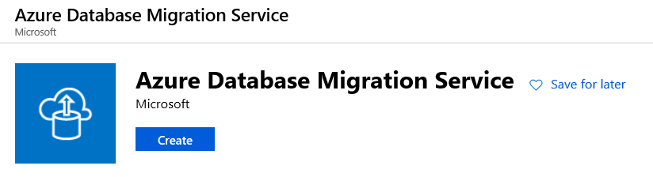

   > **Tip:** If the migration service blade will not load, refresh the portal blade in your browser.

4. In the **Create Migration Service** blade enter the following values and select **Create**.

    - Service Name: **SmartHotelDBMigration**
    - Subscription: **Select your Azure subscription**.
    - Resource group: **AzureMigrateRG**
    - Location: **Choose the same region as the SmartHotel host**.
    - Virtual network: Choose the existing **DMSvnet/DMS** virtual network and subnet.
    - Pricing tier: **Standard: 1 vCore**

    

> **Note:** Creating a new migration service can take around 20 minutes. You can continue to the next task without waiting for the operation to complete. You will not use the Database Migration Service until task 5.

#### Task summary <!-- omit in toc -->

In this task you created a new Azure Database Migration Service resource.

### Task 4: Assess the on-premises database using Data Migration Assistant

In this task you will install and use Microsoft SQL Server Data Migration Assistant (DMA) to assess the on-premises database. The DMA is integrated with Azure Migrate providing a single hub for assessment and migration tools.

1. Return to the Azure Migrate blade in the Azure portal. Select on the **Overview** panel, the select the **Assess and migrate databases** button.

      

2. Select **Add tool(s)** to open the 'Add a tool' wizard.

3. Under 'Select assessment tool', select **Azure Migrate: Database Assessment**, then select **Next**.

    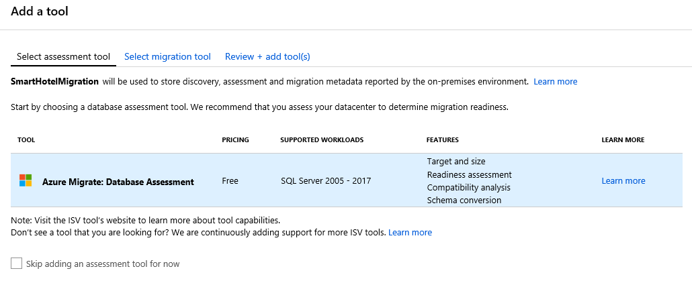

4. Under 'Select migration tool', select **Azure Migrate: Database Migration**, then select **Next**.

    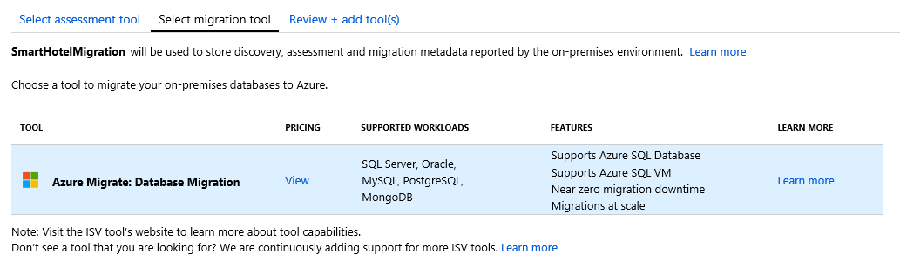

5. Under 'Review and add tools', select **Add tool(s)**.

6. Once the tools are installed in Azure Migrate, the portal should show the 'Azure Migrate - Databases' blade. Under 'Azure Migrate: Database Assessment' select **+ Assess**.

    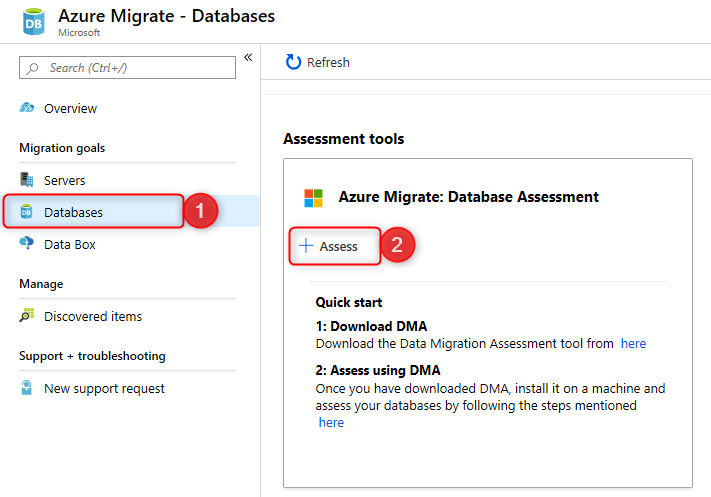

7. Select the **Download** button to open the Data Migration Assistant download page. Copy the page URL to the clipboard.

8. Return to your remote desktop session with the **SmartHotelHost** VM. Open **Chrome** from the desktop and paste the Data Migration Assistant download URL into the address bar. Download and install the Data Migration Assistant.

9. From within **SmartHotelHost** launch **Microsoft Data Migration Assistant** using the desktop icon. 

10. In the Data Migration Assistant, select the New (+) icon, and then select the **Assessment** project type.

11. Specify a project name (*e.g.* SmartHotelAssessment), in the **Source server type** text box select **SQL Server**, in the **Target server type** text box, select **Azure SQL Database**, and then select **Create** to create the project.

    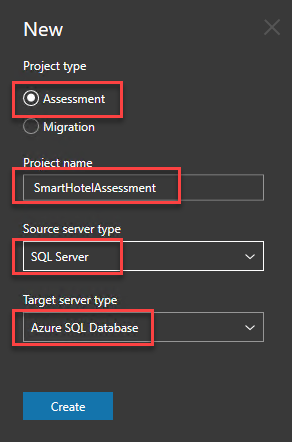

12. On the **Options** tab select **Next**.

13. On the **Select sources** screen, in the **Connect to a server** dialog box, provide the connection details to the SQL Server, and then select **Connect**.

    - Server name: **192.168.0.6**
    - Authentication type: **SQL Server Authentication**
    - Username: **sa**
    - Password: **demo@pass123**
    - Encrypt connection: **Checked**
    - Trust server certificate: **Checked**

    

14. In the **Add sources** dialog box, select **SmartHotel.Registration**, then select **Add**.

    

15. Select **Start Assessment** to start the assessment. 

    

16. **Wait** for the assessment to complete, and review the results. The results should show one unsupported feature, 'Service Broker feature is not supported in Azure SQL Database'. For this migration, you can ignore this issue.

    > **Note:** For Azure SQL Database, the assessments identify feature parity issues and migration blocking issues.
    >- The SQL Server feature parity category provides a comprehensive set of recommendations, alternative approaches available in Azure, and mitigating steps to help you plan the effort into your migration projects.
    >- The Compatibility issues category identifies partially supported or unsupported features that reflect compatibility issues that might block migrating on-premises SQL Server database(s) to Azure SQL Database. Recommendations are also provided to help you address those issues.

17. Select the **Upload to Azure Migrate** button to upload the database assessment to your Azure Migrate project (this button may take a few seconds to become enabled).

    

18. Enter your subscription credentials when prompted. Select your **Subscription** and **Azure Migrate Project** using the dropdowns, then select **Upload**. Once the upload is complete, select **OK** to dismiss the notification.

    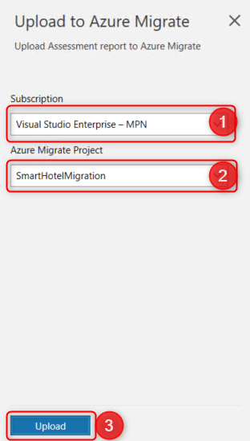

    Once the upload is complete, select **OK** to dismiss the notification.

19. Minimize the remote desktop window and return to the **Azure Migrate - Databases** blade in the Azure portal. Refreshing the page should now show the assessed database.

    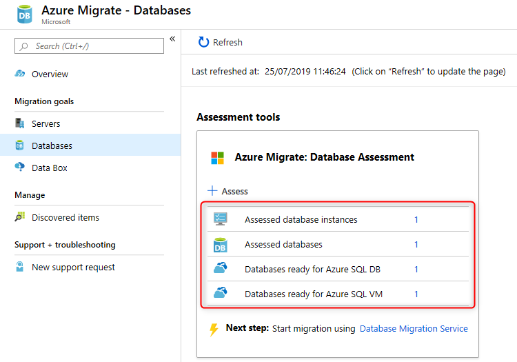

#### Task summary <!-- omit in toc -->

In this task you used Data Migration Assistant to assess an on-premises database for readiness to migrate to Azure SQL, and uploaded the assessment results to your Azure Migrate project. The DMA is integrated with Azure Migrate providing a single hub for assessment and migration tools.

### Task 5: Create a DMS migration project

In this task you will create a Migration Project within the Azure Database Migration Service. This project contains the connection details for both the source and target databases.

In subsequent tasks, you will use this project to migrate both the database schema and the data itself from the on-premises SQL Server database to the Azure SQL Database.

1. Check that the Database Migration Service resource you created in task 3 has completed provisioning. You can check the deployment status from the **Deployments** pane in the **AzureMigrateRG** resource group blade.

    

2. Navigate to the Database Migration Service resource blade in **AzureMigrateRG** resource group and select **+ New Migration Project**.

    

3. In the 'New migration project' blade, enter **DBMigrate** as the project name. Leave the source server type as **SQL Server** and target server type as **Azure SQL Database**. Select on **Choose type of activity** and select **Create project only**. Select **Save** then select **Create**.

    

4. The Migration Wizard opens, showing the 'Select source' step. Complete the settings as follows, and select **Save**.

    - Source SQL Server instance name: **10.0.0.4**
    - Authentication type: **SQL Authentication**
    - User Name: **sa**
    - Password: **demo@pass123**
    - Encryption connection: **Checked**
    - Trust server certificate: **Checked**

    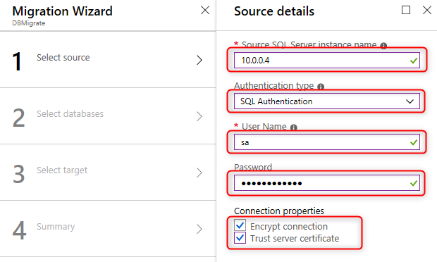

    > **Note**: The DMS service connects to the Hyper-V host, which has been pre-configured with a NAT rule to forward incoming SQL requests (TCP port 1433) to the SQL Server VM. In a real-world migration, the SQL Server VM would most likely have its own IP address on the internal network, via an external Hyper-V switch.
    >
    > The Hyper-V host is accessed via its private IP address (10.0.0.4). The DMS service accesses this IP address over the peering connection between the DMS VNet and the SmartHotelHost VNet. This simulates a VPN or ExpressRoute connection between a DMS VNet and an on-premises network.

5. In the 'Select databases' step, the **Smarthotel.Registration** database should already be selected. Select **Save**.

    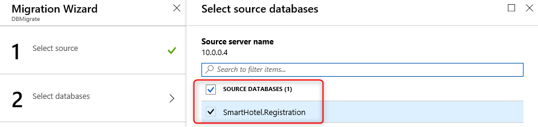

6. Complete the 'Select target' step as follows, then select **Save**:

    - Target server name: **Value from your database, {something}.database.windows.net**.
    - Authentication type: **SQL Authentication**
    - User Name: **demouser**
    - Password: **demo@pass123**
    - Encrypt connection: **Checked**

    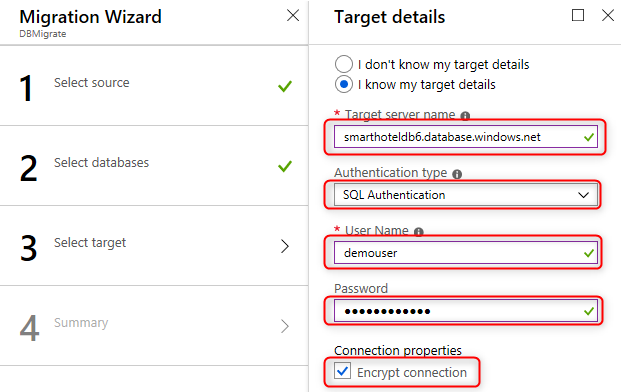

    > **Note:** You can find the target server name in the Azure portal by browsing to your database.

    

7. At the 'Project summary' step, review the settings and select **Save** to create the migration project.

    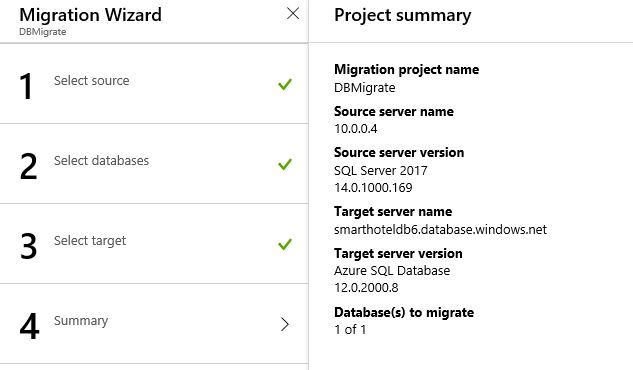

#### Task summary <!-- omit in toc -->

In this task you created a Migration Project within the Azure Database Migration Service. This project contains the connection details for both the source and target databases.

### Task 6: Migrate the database schema

In this task you will use the Azure Database Migration Service to migrate the database schema to Azure SQL Database. This step is a prerequisite to migrating the data itself.

The schema migration will be carried out using a schema migration activity within the migration project created in task 5.

1. Following task 5, the Azure portal should show a blade for the DBMigrate DMS project. Select **+ New Activity** and select **Schema only migration** from the drop-down.

    

2. The Migration Wizard is shown. Most settings are already populated from the existing migration project. At the 'Select source' step, re-enter the source database password **demo@pass123**, then select **Save**.

    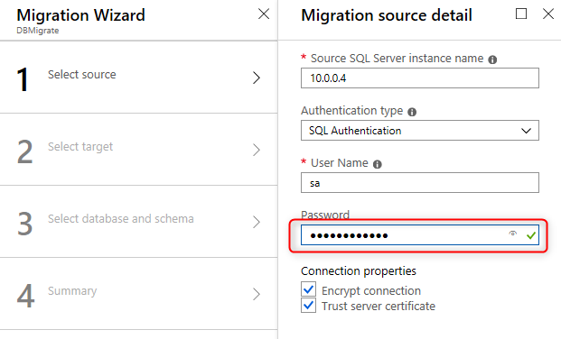

3. At the 'Select target' step, enter the password **demo@pass123** and select **Save**.

    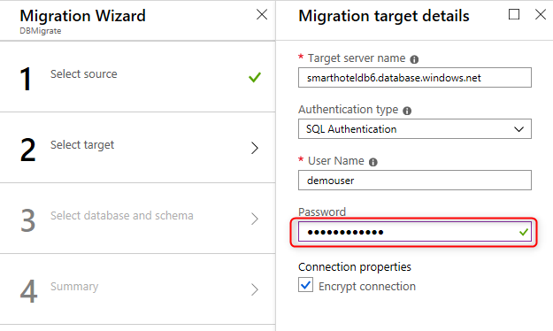

4. At the 'Select database and schema' step, check the **SmartHotel.Registration** database is selected. Under 'Target Database' select **smarthoteldb** and under 'Schema Source' select **Generate from source**. Select **Save**.

    

5. At the 'Summary' step, enter **SchemaMigration** as the 'Activity name' and choose any database validation option. Select **Run migration** to start the schema migration process.

    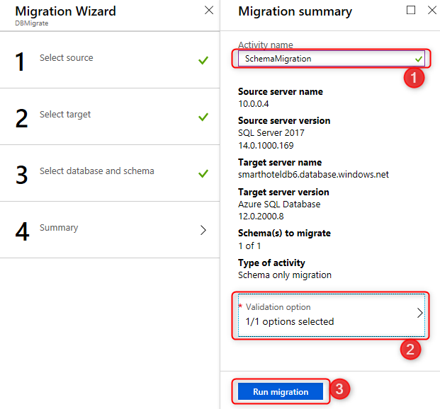

6. The schema migration will begin. Select the **Refresh** button and watch the migration progress, until it shows as **Completed**.

    

#### Task summary <!-- omit in toc -->

In this task you used a schema migration activity in the Azure Database Migration Service to migrate the database schema from the on-premises SQL Server database to the Azure SQL database.

### Task 7: Migrate the on-premises data

In this task you will use the Azure Database Migration Service to migrate the database data to Azure SQL Database.

The schema migration will be carried out using an offline data migration activity within the migration project created in task 5.

1. Return to the Azure portal blade for your **DBMigrate** migration project in DMS. Select **+ New Activity** and select **Offline data migration** from the drop-down.

    

2. The Migration Wizard is shown. Most settings are already populated from the existing migration project. At the 'Select source' step, re-enter the source database password **demo@pass123**, then select **Save**.

    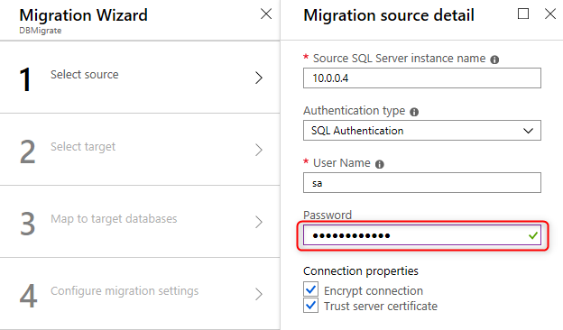

3. At the 'Select target' step, enter the password **demo@pass123** and select **Save**.

    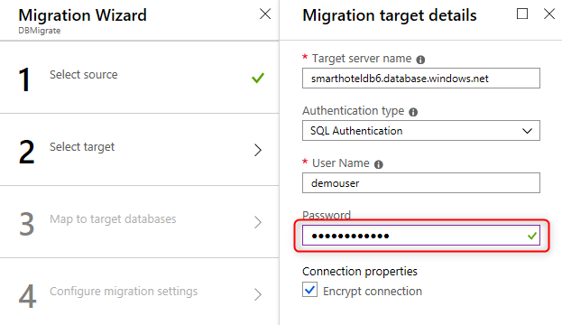

4. At the 'Map to target databases' step, check the **SmartHotel.Registration** database is selected. Under 'Target Database' select **smarthoteldb**. Select **Save**.

    

5. The 'Configure migration settings' step allows you to specify which tables should have their data migrated. Select the **Bookings** table and select **Save**.

    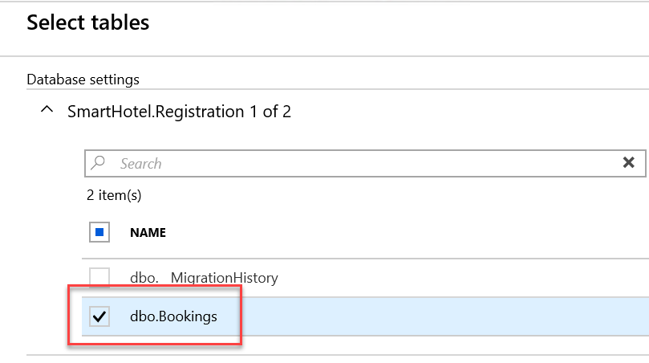

6. At the **Migration summary** step, enter **DataMigration** as the 'Activity name' and choose any value for the 'Validation option'. Select **Run migration**.

    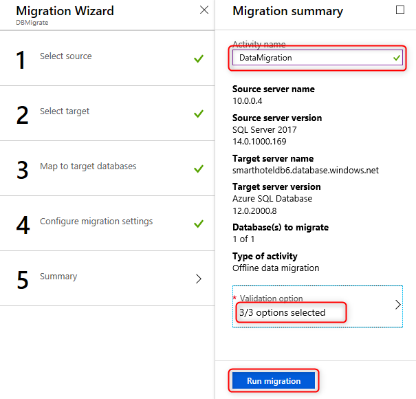

7. The data migration will begin. Select the **Refresh** button and watch the migration progress, until it shows as **Completed**.

    

#### Task summary <!-- omit in toc -->

In this task you used an off-line data migration activity in the Azure Database Migration Service to migrate the database data from the on-premises SQL Server database to the Azure SQL database.

### Exercise summary <!-- omit in toc -->

In this exercise you migrated the application database from on-premises to Azure SQL Database. The SQL Server Data Migration Assistant was used for migration assessment, and the Azure Database Migration Service was used for schema migration and data migration.

## Exercise 3: Migrate the application and web tiers using Azure Migrate: Server Migration

Duration: 90 minutes

In this exercise you will migrate the web tier and application tiers of the application from on-premises to Azure using Azure Migrate: Server Migration.

Having migrated the virtual machines, you will reconfigure the application tier to use the application database hosted in Azure SQL. This will enable you to verify that the migration application is working end-to-end.

### Task 1: Create a Storage Account

In this task you will create a new Azure Storage Account that will be used by Azure Migrate: Server Migration for storage of your virtual machine data during migration.

1. In the Azure portal, select **+Create a resource**, then select **Storage**, followed by **Storage account**.

    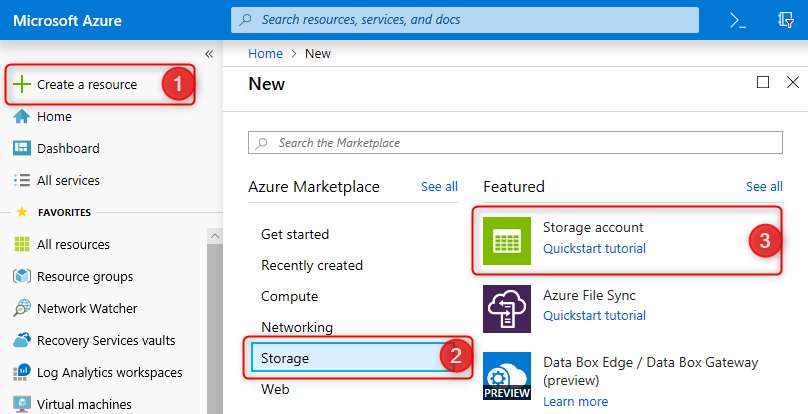

2. In the **Create storage account** blade on the **Basics** tab, use the following values:

    - Subscription: **Select your Azure subscription**.
    - Resource group (select existing): **AzureMigrateRG**
    - Storage account name: **migrationstorage\[unique number\]**
    - Location: **IMPORTANT: Select the same location as your Azure SQL Database**.
    - Account kind: **Storage (general purpose v1)** (do not use a v2 account)
    - Replication: **Locally-redundant storage (LRS)**

    

3. Select **Review + create**, then select **Create**.

#### Task summary <!-- omit in toc -->

In this task you created a new Azure Storage Account that will be used by Azure Migrate.

### Task 2: Create a Virtual Network

In this task you will create a new virtual network that will be used by your migrated virtual machines when they are migrated to Azure. (Azure Migrate will only create the VMs, their network interfaces, and their disks; all other resources must be staged in advance.)

1. In the Azure portal, select **+Create a resource**, then select **Networking**, followed by **Virtual network**.

    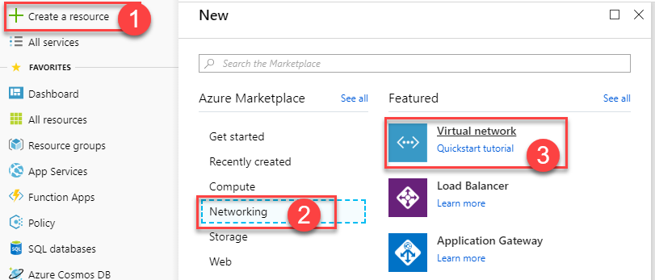

2. In the **Create virtual network** blade, enter the following values and select **Create**.

    - Name: **SmartHotelVNet**
    - Address space: **192.168.0.0/24** 
    - Subscription: **Select your Azure subscription**.
    - Resource group: (create new) **SmartHotelRG**
    - Location: **IMPORTANT: Select the same location as your Azure SQL Database**.
    - Subnet: **SmartHotel**
    - Subnet address range: **192.168.0.0/24**

    

#### Task summary <!-- omit in toc -->

In this task you created a new virtual network that will be used by your virtual machines when they are migrated to Azure. 

### Task 3: Register the Hyper-V Host with Azure Migrate Server Migration

In this task, you will register your Hyper-V host with the Azure Migrate: Server Migration service. This service uses Azure Site Recovery as the underlying migration engine. As part of the registration process, you will deploy the Azure Site Recovery Provider on your Hyper-V host.

1. Return to the **Azure Migrate** blade in the Azure Portal, and select **Servers**. Under 'Migration Tools', select **Discover**.

    

2. In the 'Discover machines' panel, under 'Are your machines virtualized', select **Yes, with Hyper-V**. Under 'Target region' enter **the same region as used for your Azure SQL Database** and check the confirmation checkbox. Select **Create resources** to begin the deployment of the Azure Site Recovery resource used by Azure Migrate: Server Migration for Hyper-V migrations.

    

    Once deployment is complete, the 'Discover machines' panel should be updated with additional instructions.
  
3. Copy the **Download** link for they Hyper-V replication provider software installer to your clipboard.

    

4. Open the **SmartHotelHost** remote desktop window, launch **Chrome** from the desktop shortcut, and paste the link into a new browser tab to download the Azure Site Recovery provider installer.

5. Return to the 'Discover machines' view in your browser (outside the SmartHotelHost remote desktop session). Select the **Download** button and download the registration key file.

    

6. Open the file location in Windows Explorer, and copy the file to your clipboard. Return to the **SmartHotelHost** remote desktop session and paste the file to the desktop.

7. Still within the **SmartHotelHost** remote desktop session, tun the **AzureSiteRecoveryProvider.exe** installer you downloaded a moment ago. On the **Microsoft Update** tab, select **Off** and select **Next**. Accept the default installation location and select **Install**.

    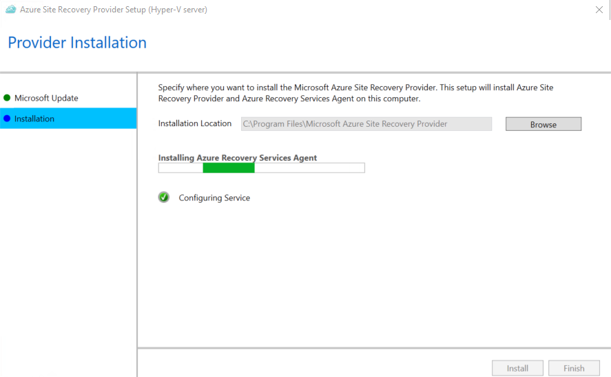

8. When the installation has completed select **Register**. Browse to the location of the key file you downloaded. When the key is loaded select **Next**.

    

9. Select **Connect directly to Azure Site Recovery without a proxy server** and select **Next**. The registration of the Hyper-V host with Azure Site Recovery will begin.

10. Wait for registration to complete (this may take several minutes). Then select **Finish**.

    

11. Minimize the SmartHotelHost remote desktop session and return to the Azure Migrate browser window. **Refresh** your browser, then re-open the 'Discover machines' panel by selecting **Discover** under 'Azure Migrate: Server Migration' and selecting **Yes, with Hyper-V** for 'Are your machines virtualized?'.

12. Select the **Finalize registration** button, which should now be enabled.

    

13. Azure Migrate will now complete the registration with the Hyper-V host. **Wait** for the registration to complete. This may take several minutes.

    

14. Once the registration is complete, close the 'Discover machines' panel.

    

15. The 'Azure Migrate: Server Migration' panel should now show 5 discovered servers.

    

#### Task summary <!-- omit in toc -->

In this task you registered your Hyper-V host with the Azure Migrate Server Migration service.

### Task 4: Enable Replication from Hyper-V to Azure Migrate

In this task, you will configure and enable the replication of your on-premises virtual machines from Hyper-V to the Azure Migrate Server Migration service.

1. Under 'Azure Migrate: Server Migration', select the **Replicate** button. This opens the 'Replicate' wizard.

    

2. In the 'Source settings' tab, under 'Are your machines virtualized?', select **Yes, with Hyper-V** from the drop-down. Then select **Next: Virtual machines**.

    

3. In the 'Virtual machines' tab, under 'Import migration settings from an assessment', select **Yes, apply migration settings from an Azure Migrate assessment**. Select the **SmartHotel VMs** VM group and the **SmartHotelAssessment** migration assessment.

    

4. The 'Virtual machines' tab should now show the virtual machines included in the assessment. Select the **UbuntuWAF**, **smarthotelweb1**, and **smarthotelweb2** virtual machines, then select **Next: Target settings**.

    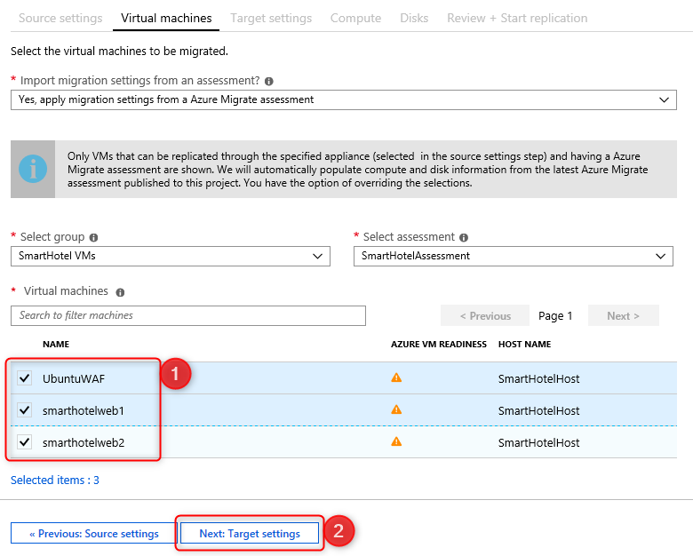

5. In the 'Target settings' tab, select your subscription and the existing **SmartHotelRG** resource group. Under 'Replication storage account' select the **storage account you created in task 1** and under 'Virtual Network' and 'Subnet' select the **network you created in Task 2**.

    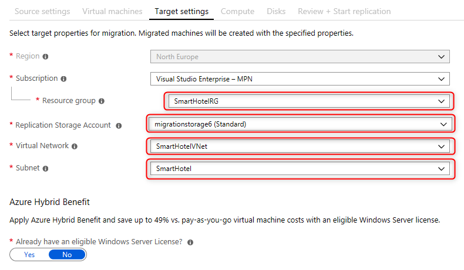

    Select **Next: Compute**.

6. In the 'Compute' tab, select the VM size and OS type as shown in the table.

    | Name           | Azure VM Size   | OS Type |
    | -------------- | --------------- | ------- |
    | UbuntuWAF      | Standard_F2s_v2 | Linux   |
    | smarthotelweb1 | Standard_F2s_v2 | Windows |
    | smarthotelweb2 | Standard_F2s_v2 | Windows |

    > **Note:** If you are using an Azure Pass subscription, your subscription may not have a quota allocated for FSv2 virtual machines. In this case, use **DS2_v2 or D2s_v3** virtual machines instead.

    

    Select **Next: Disks**.

7. In the 'Disks' tab, review the settings but do not make any changes. Select **Next: Review + Start replication**, then select **Replicate** to start the server replication.

8. In the 'Azure Migrate - Servers' blade, under 'Azure Migrate: Server Migration', select the **Overview** button.

    

9. Confirm that 3 machines are replicating.

    

10. Select **Replicating Machines**.  Select **Refresh** occasionally and wait until all three machines show 'Status' as **Protected**, which shows the initial replication is complete. This may take several minutes.

    

#### Task summary <!-- omit in toc -->

In this task you enabled replication from the Hyper-V host to Azure Migrate, and configured the replicated VM size in Azure.

### Task 5: Configure static internal IP addresses for each VM

In this task you will modify the settings for each replicated VM to use a static private IP address that matches the on-premises IP addresses for that machine.

1. Still using the 'Azure Migrate: Server Migration - Replicating machines' blade, select on the **smarthotelweb1** virtual machine. This opens a detailed migration and replication blade for this machine. Take a moment to study this information.

    

2. Select on **Compute and Network**, then **Edit**.

   

3. Confirm that the VM is configured to use the **F2s_v2 (2 cores, 4GB memory, 1 NICs)** VM size (or **DS2_v2 or D2s_v3** if using an Azure Pass subscription) and 'Use managed disks' is set to **Yes**.

4. Under **Network Interfaces**, select on **InternalNATSwitch** to open the network interface settings.

    

5. Change the **Private IP address** to **192.168.0.4**.

    

6. Select **OK** to close the network interface settings blade, then **Save** the smarthotelweb1 settings.

7. Repeat these steps to configure the private IP address for the other VMs.
    - For **smarthotelweb2** use private IP address **192.168.0.5**.
    - For **UbuntuWAF** use private IP address **192.168.0.8**.

#### Task summary <!-- omit in toc -->

In this task you modified the settings for each replicated VM to use a static private IP address that matches the on-premises IP addresses for that machine

> **Note:** Azure Migrate makes a "best guess" at the VM settings, but you have full control over the settings of migrated items. In this case, setting a static private IP address ensures the virtual machines in Azure retain the same IPs they had on-premises, which avoids having to reconfigure the VMs during migration (for example, by editing web.config files).

### Task 6: Server migration

In this task you will perform a migration of the UbuntuWAF, smarthotelweb1, and smarthotelweb2 machines to Azure.

> **Note:** In a real-world scenario, you would perform a test migration before the final migration. To save time, you will skip the test migration in this lab. The test migration process is very similar to the final migration.

1. Return to the 'Azure Migrate: Server Migration' overview blade. Under 'Step 3: Migrate', select the **Migrate** button.

    

2. On the 'Migrate' blade, select the 3 virtual machines then select **Migrate** to start the migration process.

    

    > **Note:** You can optionally choose whether the on-premises virtual machines should be automatically shut down before migration to minimize data loss. Either setting will work for this lab.

3. The migration process will start.

    

4. To monitor progress, select **Jobs** and review the status of the three 'Planned failover' jobs.

    

5. **Wait** until all three 'Planned failover' jobs show 'Status' as **Successful**. You should not need to refresh your browser. This could take up to 15 minutes.

    

6. Navigate to the **SmartHotelRG** resource group and check that the VM, network interface, and disk resources have been created for each of the virtual machines being migrated.

   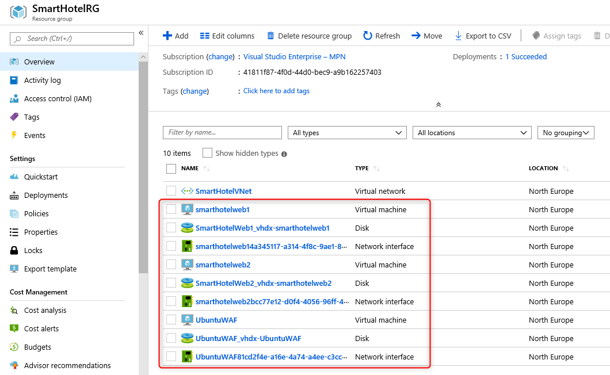

#### Task summary <!-- omit in toc -->

In this task you used Azure Migrate to create Azure VMs using the settings you have configured, and the data replicated from the Hyper-V machines. This migrated your on-premises VMs to Azure.

### Task 7: Configure the database connection

The application tier machine **smarthotelweb2** is configured to connect to the application database running on the **smarthotelsql** machine.

On the migrated VM **smarthotelweb2**, this configuration needs to be updated to use the Azure SQL Database instead.

As a preliminary step, you will temporarily associate a public IP address with the **smarthotelweb2** VM, so that you can connect to the VM using Remote Desktop. (Alternatively, you could connect via a separate 'jumppbox' VM, or via a Site-to-Site or ExpressRoute connection.)

> **Note:** You do not need to update any configuration files on **smarthotelweb1** or the **UbuntuWAF** VMs, since the migration has preserved the private IP addresses of all virtual machines they connect with.

1. Select **+ Create a resource** and enter **Public IP Address** in the search box. In the **Public IP Address** blade select **Create**.

    

2. Create a new public IP address with the following values (plus defaults) and select **Create**.

    - Name: **smarthotel-ip**
    - Resource group: **SmartHotelRG**
    - Location: **Select the same location as the smarthotelweb2 VM**.

    

3. Browse to the **smarthotelweb2** VM, select **Networking**, and then select the name of the **Network interface** associated with the virtual machine.

    

4. In the network interface settings, select **IP configurations** and then select on the available configuration.

    

5. Change the **Public IP address** to **Enabled**, select **SmartHotel-IP** and select **Save**.

    

6. Return to the **smarthotelweb2** VM overview blade, and select **Connect**. Download the RDP file and connect to the machine with the username **Administrator** and the password **demo@pass123**.

    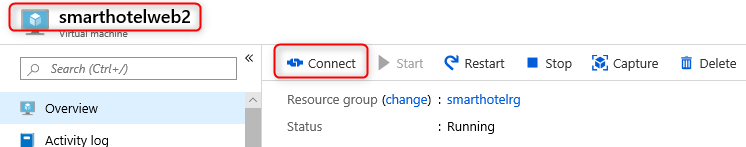

7. In the **smarthotelweb2** remote desktop session, open Windows Explorer and navigate to the **C:\\inetpub\\SmartHotel.Registration.Wcf** folder. Double-select the **Web.config** file and open with Notepad.

8. Update the **DefaultConnection** setting to connect to your Azure SQL Database.

    You can find the connection string for the Azure SQL Database in the Azure portal by browsing to the database, and selecting **Show database connection strings**.

     

    Copy the connection string, and paste into the web.config file on **smarthotelweb2**, replacing the existing connection string.  Be careful not to overwrite the 'providerName' parameter which is specified after the connection string.

    Make the following changes to the connection string:
    - Set the User ID to **demouser**.
    - Set the Password to **demo@pass123**.

    
    

9. Save the web.config file and exit your remote desktop session.

10. Browse to **SmartHotelWeb2**, select **Networking**, and then select the name of the **Network interface** associated with the virtual machine.

    

11. In the network interface settings, select **IP configurations** and then select on the available configuration.

    

12. Change the **Public IP address** to **Disabled** and select **Save**.

    

#### Task summary <!-- omit in toc -->

In this task, you updated the **smarthotelweb2** configuration to connect to the Azure SQL Database.

### Task 8: Configure the public IP address and test the SmartHotel application

In this task, you will associate the public IP address with the UbuntuWAF VM. This will allow you to verify that the SmartHotel application is running successfully in Azure.

1. Using similar steps to Task 8, associate the public IP address resource **SmartHotel-IP** with the network interface of the **UbuntuWAF** VM.

    

2. Return to the **UbuntuWAF** VM overview blade and copy the **Public IP address** value.

    

3. Open a new browser tab and paste the IP address into the address bar. Verify that the SmartHotel360 application is now available in Azure.

    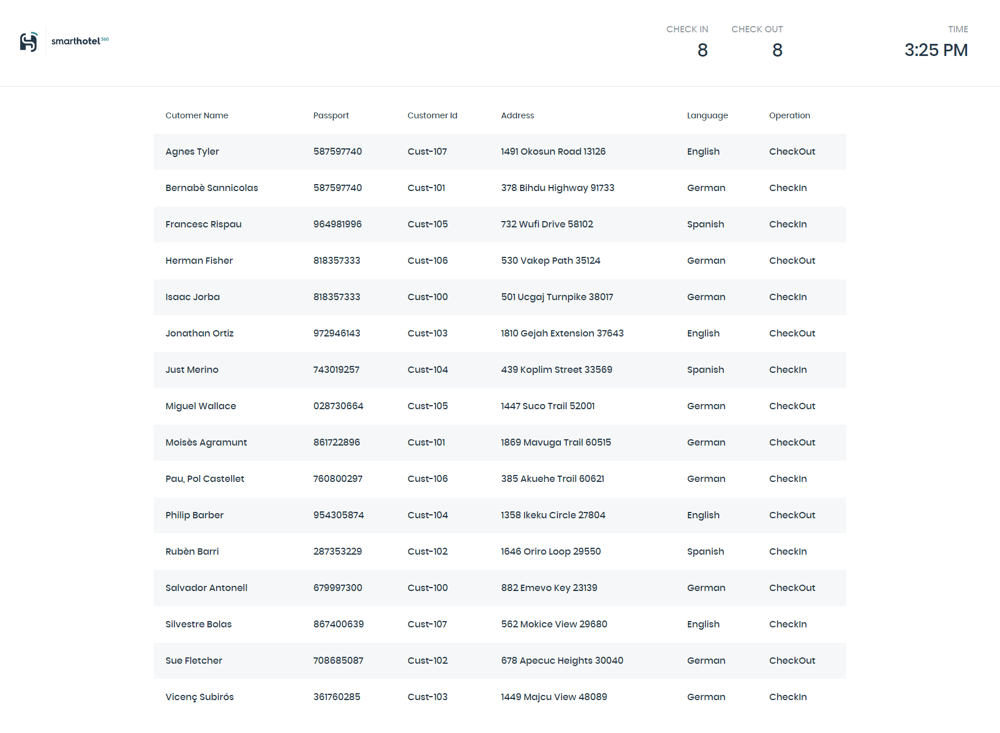

#### Task summary <!-- omit in toc -->

In this task, you assigned a public IP address to the UbuntuWAF VM and verified that the SmartHotel application is now working in Azure.

### Task 9: Post-migration steps

There are a number of post-migration steps that should be completed before the migrated services is ready for production use. These include:

- Installing the Azure VM Agent
- Cleaning up migration resources
- Enabling backup and disaster recovery
- Encrypting VM disks
- Ensuring the network is properly secured
- Ensuring proper subscription governance is in place, such as role-based access control and Azure Policy
- Reviewing recommendations from Azure Advisor and Security Center

In this task you will install the Azure Virtual Machine Agent (VM Agent) on your migrated Azure VMs and clean up any migration resources. The remaining steps are common for any Azure application, not just migrations, and are therefore out of scope for this hands-on lab.

> **Note:** The Microsoft Azure Virtual Machine Agent (VM Agent) is a secure, lightweight process that manages virtual machine (VM) interaction with the Azure Fabric Controller. The VM Agent has a primary role in enabling and executing Azure virtual machine extensions. VM Extensions enable post-deployment configuration of VM, such as installing and configuring software. VM extensions also enable recovery features such as resetting the administrative password of a VM. Without the Azure VM Agent, VM extensions cannot be used.
>
> In this lab, you will install the VM agent on the Azure VMs after migration. Alternatively, you could instead install the agent on the VMs in Hyper-V before migration.

1. In the Azure portal, locate the **smarthotelweb1** VM and open a remote desktop session. Log in to the **Administrator** account using password **demo@pass123** (use the 'eyeball' to check the password was entered correctly with your local keyboard mapping).

2. Open a web browser and download the VM Agent from:

    ```s
    https://go.microsoft.com/fwlink/?LinkID=394789
    ```

3. After the installer has downloaded, run it. Select **Next**, **I accept the terms in the License Agreement**, and then **Next** again. Select **Finish**.

    

4. Close the smarthotelweb1 window. Repeat the Azure VM agent installation process on **smarthotelweb2**.

    You will now install the Linux version of the Azure VM Agent on the Ubuntu VM. All Linux distributions supports by Azure have integrated the Azure VM Agent into their software repositories, making installation easy in most cases.

5. In the Azure portal, locate the **UbuntuWAF** VM and note the public IP address. Open a new browser tab and navigate to **https://shell.azure.com**, accept and prompts and open a **Bash shell** session (not a PowerShell session).

    

6. Enter the following command, replacing \<ip address\> with the public IP address of the UbuntuWAF VM:

    ```s
    ssh demouser@<ip address>
    ```

7. Enter 'yes' if prompted whether to connect. Use the password **demo@pass123**.

    

8. In the terminal window, enter the following command:

    ```s
    sudo apt-get install walinuxagent
    ```

    When prompted, enter the password **demo@pass123**. At the *Do you want to continue?* prompt, type **Y** and press **Enter**.

    

9. Wait for the installer to finish, then close the terminal window and the Ubuntu VM window.

10. As a final step, you will now clean up the resources that were created to support the migration and are no longer needed. These include the Azure Migrate project, the Recovery Service Vault (Azure Site Recovery resource) used by  Azure Migrate: Server Migration, and the Database Migration Service instance. Also included are various secondary resources such as the Log Analytics workspace used by the Dependency Visualization, the storage account used by Azure Migrate: Server Migration, and a Key Vault instance.

    Because all of these temporary resources have been deployed to a separate **AzureMigrateRG** resource group, deleting them is as simple as deleting the resource group. Simply navigate to the resource group blade in the Azure portal, select **Delete resource group** and complete the confirmation prompts.

#### Task summary <!-- omit in toc -->

In this task you installed the Azure Virtual Machine Agent (VM Agent) on your migrated VMs. You also cleaned up the temporary resources created during the migration process.

### Exercise summary <!-- omit in toc -->

In this exercise you migrated the web tier and application tiers of the application from on-premises to Azure using Azure Migrate: Server Migration. Having migrated the virtual machines, you reconfigured the application tier to use the migrated application database hosted in Azure SQL Database, and verified that the migrated application is working end-to-end. You also installed the VM Agent on the migrated virtual machines, and cleaned up migration resources.

## After the hands-on lab

Duration: 10 minutes

### Task 1: Clean up resources

You should complete all of these steps *after* attending the Hands-on lab. Failure to delete the resources created during the lab will result in continued billing.

1. Delete the resource group containing the SmartHotelHost.

2. Delete the **SmartHotelDBRG** resource group containing the Azure SQL Database.

3. Delete the **SmartHotelRG** resource group containing the migrated VMs and related infrastructure resources.

4. Delete the **AzureMigrateRG** resource group containing the Azure Migrate resources (if not done already at the end of Exercise 3).
